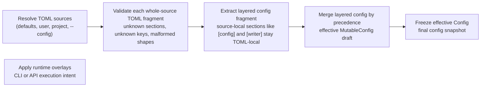

<!--
topmark:header:start

  project      : TopMark
  file         : index.md
  file_relpath : docs/configuration/index.md
  license      : MIT
  copyright    : (c) 2025 Olivier Biot

topmark:header:end
-->

# Configuration Overview

TopMark supports layered configuration with explicit precedence:

- **Defaults** → **User** (e.g. `$HOME/.config/topmark.toml`) → **Project chain** (root → current) →
  **`--config`** → **CLI**
- **Globs declared in config files** are resolved relative to the **directory of that config file**.
- **Globs declared via CLI** are resolved relative to the **current working directory** (invocation
  site).
- **Path-to-file settings** (e.g., `exclude_from`, `files_from`) are resolved relative to the
  **declaring config file** (or CWD for CLI-provided values).
- **Merge semantics vary by field**: behavioral settings usually use nearest-wins semantics, mapping
  fields usually overlay keys, and discovery inputs usually accumulate across applicable layers.
- **Config-loading behaviour (e.g. `strict_config_checking`) is resolved from TOML sources**
  (`[config]` / `[tool.topmark.config]`) during TOML loading and applied after layered merging; it
  is not a regular layered configuration field. In the current implementation, effective strictness
  applies to the aggregated config-resolution/preflight diagnostic pool (see
  [Config-loading behaviour](./discovery.md#config-loading-behaviour-toml-level)).
- `relative_to` affects only header metadata (e.g., `file_relpath`), not discovery.

TopMark also provides an inspection mode via `topmark config dump --show-layers` that exposes
**layered configuration provenance**. This shows how the final configuration is constructed from
individual TOML sources and CLI overrides, including their original TOML fragments.

During loading, TopMark first validates each whole-source TOML fragment (unknown sections, unknown
keys, malformed section shapes, missing known sections, etc.). Only the validated layered config
fragment is then passed into layered config merging.

At the TOML layer, malformed known sections are handled as warning-and-ignore cases, while missing
known sections are emitted as INFO diagnostics. This lets callers distinguish absent sections from
malformed-present sections before config/runtime semantics are applied.

## Configuration flow at a glance

This reflects the main distinction in TopMark's configuration model:

- TOML sources are validated first at the **whole-source TOML layer**.
- Only the validated **layered config fragment** contributes to config merging.
- The merged layered result is frozen into one **effective config**.
- Runtime overlays are then applied for execution-only concerns such as output mode, apply/dry-run
  behavior, or stdin handling.

Start here:

- [`Discovery & Precedence`](./discovery.md)
- [`Merge semantics by field`](./discovery.md#merge-semantics-overview)
- [`Root semantics`](./discovery.md#root-semantics) for how discovery stops at
  `[config].root = true`
- [`Policy resolution`](./discovery.md#policy-resolution) for understanding how policy settings are
  defined and overridden at global level and per file type.

See Also:

- [Example TOML document](./generated/example-config.md) for the generated reference configuration
  used by `topmark config init` (rendered from the bundled example TOML resource
  `src/topmark/toml/topmark-example.toml`)
- API docs:
  - `resolve_toml_sources_and_build_config_draft()`
  - `Config`, `MutableConfig`
- Usage: [`config dump`](../usage/commands/config/dump.md) for inspecting the effective
  configuration and layered provenance
