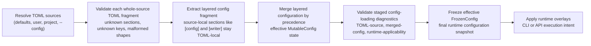

<!--
topmark:header:start

  project      : TopMark
  file         : index.md
  file_relpath : docs/configuration/index.md
  license      : MIT
  copyright    : (c) 2025 Olivier Biot

topmark:header:end
-->

# Configuration overview

TopMark supports layered configuration with explicit precedence:

- **Defaults** → **User** (e.g. `$HOME/.config/topmark.toml`) → **Project chain** (root → current) →
  **`--config`** → **CLI**
- **Globs declared in config files** are resolved relative to the **directory of that config file**.
- **Globs declared via CLI** are resolved relative to the **current working directory** (invocation
  site).
- **Path-to-file settings** (e.g., `exclude_from`, `files_from`) are resolved relative to the
  **declaring config file** (or CWD for CLI-provided values).
- **Merge semantics vary by field**: behavioral settings usually use nearest-wins semantics, mapping
  fields usually overlay keys, and discovery inputs usually accumulate across applicable layers.
- **Config-loading behavior (e.g. `strict`) is resolved from TOML sources** (`[config]` /
  `[tool.topmark.config]`) during TOML loading and applied after layered merging; it is not a
  regular layered configuration field. Effective strictness applies across staged config-loading
  validation logs (see
  [Config-loading behavior](./discovery.md#config-loading-behaviour-toml-level)).
- `relative_to` affects only header metadata (e.g., `file_relpath`), not discovery.
- **File type identifiers** may be written in local form such as `python` or qualified form such as
  `topmark:python`. TopMark normalizes identifiers to canonical qualified keys during configuration
  normalization. For the user-facing contract, see
  [Configuration discovery, precedence, and policy](../usage/configuration.md#file-type-identifiers).



TopMark also provides an inspection mode via
[`topmark config dump --show-layers`](../usage/commands/config/dump.md) that exposes layered
configuration provenance. This shows how the effective runtime configuration is constructed from
individual TOML sources and CLI overrides, including their original TOML fragments.

During loading, TopMark first validates each whole-source TOML fragment (unknown sections, unknown
keys, malformed section shapes, missing known sections, etc.). Only the validated layered
configuration fragment is then passed into layered configuration merging.

At the TOML layer, malformed known sections are handled as warning-and-ignore cases, while missing
known sections are emitted as INFO diagnostics. This lets callers distinguish absent sections from
malformed-present sections before staged configuration-validation semantics are applied.

These TOML-source diagnostics are then evaluated together with merged-config and
runtime-applicability diagnostics during staged config-loading validation.

For the full discovery, precedence, path-resolution, and staged validation contract, see
[Configuration discovery, precedence, and policy](./discovery.md).

______________________________________________________________________

## Configuration flow at a glance

This reflects the main distinction in TopMark's configuration model:

- TOML sources are validated first at the **whole-source TOML layer**.
- Only the validated layered configuration fragment contributes to layered configuration merging.
- The merged layered result is then validated across staged config-loading diagnostics.
- The validated layered result becomes one immutable effective runtime configuration.
- Runtime overlays are then applied for execution-only concerns such as output mode, apply/dry-run
  behavior, or stdin handling.

______________________________________________________________________

## Start here

- [`Configuration discovery, precedence, and policy`](./discovery.md)
- [`Merge semantics by field`](./discovery.md#merge-semantics-overview)
- [`Root semantics`](./discovery.md#root-semantics) for how discovery stops at
  `[config].root = true`
- [`Policy resolution`](./discovery.md#policy-resolution) for understanding how policy settings are
  defined and overridden at global level and per file type.
- [Configuration](../usage/configuration.md) for the public TOML, CLI, and API identifier contract.
- [CLI overview](../usage/cli.md) for command-line execution and shared command options.

______________________________________________________________________

## See also

- [Example TOML document](./generated/example-config.md) for the generated reference configuration
  used by `topmark config init` (rendered from the bundled example TOML resource
  `src/topmark/toml/topmark-example.toml`)
- API documentation:
  - \[`resolve_toml_sources_and_build_mutable_config()`\][topmark.config.resolution.bridge.resolve_toml_sources_and_build_mutable_config]
  - \[`FrozenConfig`\][topmark.config.model.FrozenConfig],
    \[`MutableConfig`\][topmark.config.model.MutableConfig]
- Usage: [`config dump`](../usage/commands/config/dump.md) for inspecting the effective
  configuration and layered provenance
- [Configuration](../usage/configuration.md)
- [Filtering recipes](../usage/filtering.md)
- [Policy guide](../usage/policies.md)
- [CLI overview](../usage/cli.md)
- [Machine-readable output](../dev/machine-output.md)
- [Terminology and Canonical Vocabulary](../terminology.md)
