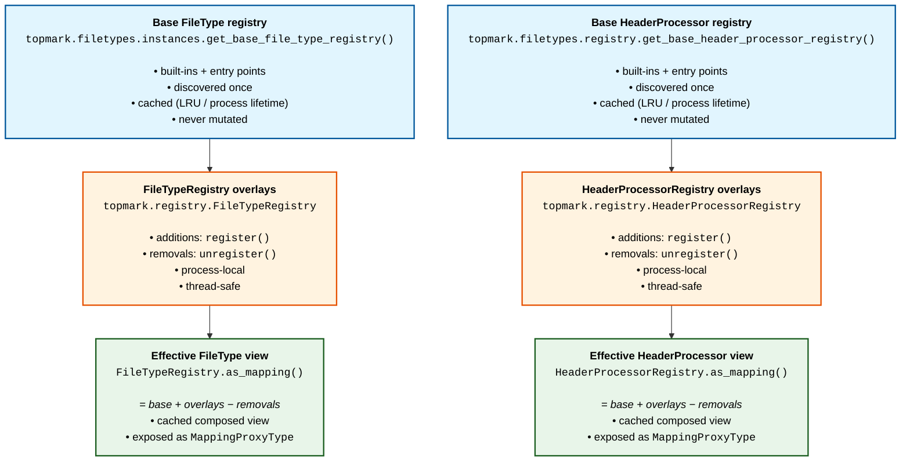
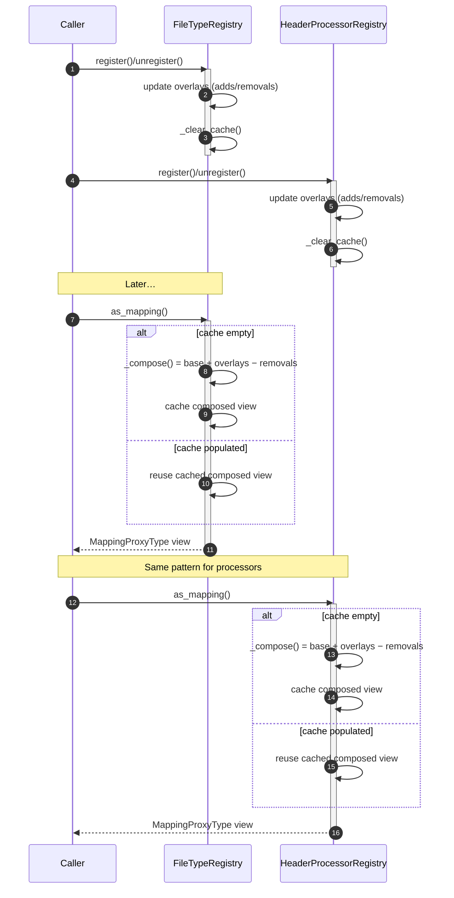

<!--
topmark:header:start

  project      : TopMark
  file         : architecture.md
  file_relpath : docs/dev/architecture.md
  license      : MIT
  copyright    : (c) 2025 Olivier Biot

topmark:header:end
-->

# Architecture Overview

This document describes key architectural decisions in TopMark that are relevant
to contributors, plugin authors, and maintainers. It focuses on *design intent*
and *invariants*, not on end-user usage.

______________________________________________________________________

## Registries: Base + Overlay Design

### Problem Statement

TopMark needs to manage two extensible concepts:

- **File types** (how files are detected and classified)
- **Header processors** (how headers are inserted/updated/removed)

Early implementations relied on *process-global mutable registries* populated
from built-ins and entry-point discovery. This caused several issues:

- Tests that mutated registries leaked state into later tests
- Plugin discovery was expensive and order-dependent
- There was no clear separation between **introspection** and **mutation**
- It was difficult to provide deterministic registries in unit tests

### Design Goals

The current registry architecture was introduced to satisfy these goals:

1. **Deterministic behavior**
   - The same inputs must produce the same results regardless of test order.
1. **Safe extensibility**
   - Plugins and tests must be able to add or remove entries without mutating
     built-ins.
1. **Clear public vs. internal API**
   - Most users should *inspect* registries, not mutate them.
1. **Efficient composition**
   - Built-ins and plugins should be discovered once and cached.
1. **Test isolation**
   - Registry mutations must be easy to reset between tests.
1. **Single source of truth for reference docs**
   - Generated docs should reflect the *actual* registries and wiring used by the running
     TopMark version.

### Registry System Architecture

The registry system is intentionally layered: immutable base registries are composed
with mutable overlay state to produce a cached, read-only effective view.

Registries are split into three conceptual layers:

### Public Facade vs. Advanced Registries

#### Stable Facade (Public API)

- `topmark.registry.Registry`

This facade exposes **read-only views** of the *effective* registries and is the
recommended integration point for tooling and downstream consumers.

Characteristics:

- Immutable mappings
- No mutation helpers
- Snapshot-tracked for API stability

#### Advanced Registries (Internal / Power-User API)

- `topmark.registry.FileTypeRegistry`
- `topmark.registry.HeaderProcessorRegistry`

These classes provide **overlay mutation helpers**:

- `register(...)`
- `unregister(...)`

Important properties:

- Mutations affect overlays only
- Built-in and plugin-discovered entries are never mutated
- Overlay changes invalidate composed-view caches automatically
- Intended for:
  - Tests
  - Plugins
  - Advanced integrations

Although these registries are snapshot-tracked for *signatures*, their **behavior**
is considered advanced and may evolve.

### Caching and Invalidation

- Base registries are cached (often via `lru_cache`) because discovery is expensive.
- Composed effective views are cached for fast access.
- Any overlay mutation (`register` / `unregister`) clears the composed cache.
- Tests must reset overlays *and* caches to avoid cross-test contamination.

Overlay mutations are intentionally cheap: they only update overlay state and clear the
composed-view cache. The next call to `as_mapping()` recomposes the effective view on demand.

Separately, TopMark’s documentation site generates “Supported file types” and
“Registered processors” pages by running the CLI in Markdown mode during the MkDocs
build. This keeps reference tables aligned with the effective registries of the
current version.

### Why Not Per-Run Registries?

Registries are intentionally **process-global** rather than per-run objects:

- Registry contents affect discovery, resolution, and pipeline wiring.
- Passing registries through every layer would significantly complicate APIs.
- Most users do not need per-run customization.

Instead:

- Configuration controls *which* file types are active for a run
- Registries control *what* file types and processors exist

### Non-Goals

The registry system is **not** designed to:

- Provide transactional or scoped registry mutation in production code
- Guarantee overlay behavior as a stable public contract
- Allow silent mutation of built-ins or plugin-provided entries

### Keys and schema stability

TopMark defines centralized constants for:

- **CLI spellings** (e.g. `--include-file-types`)
- **CLI destination keys** (the `dest` names Click stores in its parsed namespace)
- **TOML keys** used by the config model and default configuration

This reduces accidental drift between CLI help text, config parsing, and runtime logic.
Validation should occur at “seams” (CLI parsing and TOML loading) so internal code can
rely on canonical keys.

### Practical Implications for Contributors

- Prefer `Registry` (facade) when reading registry contents.
- Use overlay mutation helpers only in tests or plugin code.
- Always reset overlay state in tests that register/unregister entries.
- Treat registry internals (`_compose`, `_overrides`, caches) as private.

______________________________________________________________________

## Future Extensions

This document may later be extended with sections on:

- Pipeline architecture
- Content sniffing and normalization
- Header placement rules
- Configuration lifecycle (mutable → frozen)

For now, registry design is documented here because it underpins test isolation,
plugin extensibility, and API stability.

______________________________________________________________________

**Summary:**
Overlay registries allow TopMark to remain extensible, deterministic, and testable
without sacrificing a small, stable public API surface.
