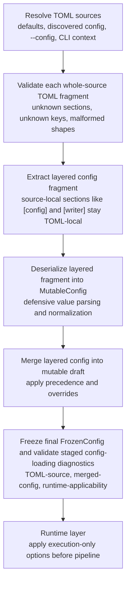

<!--
topmark:header:start

  project      : TopMark
  file         : architecture.md
  file_relpath : docs/dev/architecture.md
  license      : MIT
  copyright    : (c) 2025 Olivier Biot

topmark:header:end
-->

# Architecture Overview

This document describes key architectural decisions in TopMark that are relevant to contributors,
plugin authors, and maintainers. It focuses on *design intent* and *invariants*, not on end-user
usage.

The canonical vocabulary used by this page is defined in
[`Terminology and Canonical Vocabulary`](../terminology.md).

## Canonical architecture invariants

The following architectural contracts are frozen for 1.0:

- CLI, API, presentation, runtime, configuration, registry, and pipeline concerns remain separated.
- Runtime execution intent is kept separate from layered configuration state.
- File type identity is normalized to canonical qualified keys.
- Registry mutation is represented as explicit overlay state.
- Pipeline execution remains independent from presentation rendering.
- Machine-readable output remains independent from human-facing TEXT and Markdown output.

______________________________________________________________________

## High-level configuration architecture

TopMark separates configuration concerns into three layers:

- **TOML layer** (\[`topmark.toml`\][topmark.toml]):
  - discovery of configuration sources
  - parsing of TOML tables
  - whole-source TOML schema validation (unknown sections / keys, malformed section shapes, missing
    known sections as INFO diagnostics)
  - resolution of source-local options (e.g. `[config].root`, `strict`)
- **Config layer** (\[`topmark.config`\][topmark.config]):
  - construction of layered configuration (`ConfigLayer`)
  - deserialization of already-validated layered config fragments into `MutableConfig`
  - merging into a mutable config draft
  - field-level merge semantics and precedence rules
- **Runtime layer** (\[`topmark.runtime`\][topmark.runtime]):
  - execution-time options (e.g. writer behavior)
  - final adjustments before pipeline execution

```mermaid
flowchart TD
    A["Resolve TOML sources<br/>defaults, discovered config, --config, CLI context"]
    B["Validate each whole-source TOML fragment<br/>unknown sections, unknown keys, malformed shapes"]
    C["Extract layered config fragment<br/>source-local sections like [config] and [writer] stay TOML-local"]
    D["Deserialize layered fragment into MutableConfig<br/>defensive value parsing and normalization"]
    E["Merge layered config into mutable draft<br/>apply precedence and overrides"]
    F["Freeze final FrozenConfig and validate staged config-loading diagnostics<br/>TOML-source, merged-config, runtime-applicability"]
    G["Runtime layer<br/>apply execution-only options before pipeline"]

    A --> B --> C --> D --> E --> F --> G
```

Not all TOML-defined values become layered configuration fields. Source-local options such as
`[config].root` and `strict` are resolved on the TOML side first, then applied to config discovery
and staged config-loading validation without participating in layered config merging.



Whole-source TOML schema validation happens before layered config deserialization. The staged
config-loading validation flow is shown in the diagram above:

- \[`topmark.toml`\][topmark.toml] validates the full TopMark TOML source (including `[config]`,
  `[writer]`, unknown top-level entries, malformed section shapes, and missing known sections)
- \[`topmark.config`\][topmark.config] only receives the layered config fragment
- layered config deserializers still perform defensive value parsing so API and test callers can
  pass malformed layered fragments without crashing

At the TOML layer, malformed known sections are treated as **warning-and-ignore** cases, while
missing known sections are emitted as **INFO diagnostics** so callers can distinguish “not present”
from “present but malformed” before staged config-validation semantics are applied.

The main integration point between TOML resolution and config merging is:

- \[`resolve_toml_sources_and_build_mutable_config()`\][topmark.config.resolution.bridge.resolve_toml_sources_and_build_mutable_config]



At the architecture level, this keeps public API input shapes separate from the internal mutable
configuration construction machinery used between TOML/config resolution and runtime execution.

See also:

- [`Discovery & Precedence`](../configuration/discovery.md)
- [`Configuration overview`](../configuration/index.md)
- [`Configuration schema`](configuration-schema.md)

______________________________________________________________________

## Registry architecture

TopMark uses explicit registry layers for file type identities, header processor identities, and
file-type-to-processor bindings.

At the architecture level, the important invariants are:

- identity registration and processor binding are separate concerns;
- built-in registry data is never mutated directly;
- runtime additions and removals are represented as overlay state;
- effective registry views are composed from base registries plus overlays;
- public integrations should prefer the read-only `Registry` facade;
- advanced integrations and tests may use overlay mutation helpers deliberately.

Detailed registry behavior, including base/overlay composition, caching, invalidation, bindings,
qualified/local file type identifiers, plugin integration, and registry CLI inspection, is
documented in [`Registry model`](registry-model.md).

See also:

- [`Registry model`](registry-model.md) — detailed registry layers, bindings, overlays, and
  identifier semantics
- [`Plugins`](plugins.md) — plugin extension points and runtime processor overlays
- [`Resolution`](resolution.md) — path-based winner selection and ambiguity policy
- [`Configuration`](../usage/configuration.md) — public file type identifier semantics

______________________________________________________________________

## File resolution diagnostics and exit-code boundaries

TopMark’s file selection layer separates **selected processing inputs** from **discovery
diagnostics**. The resolver returns a structured file-list resolution result containing:

- `selected` — concrete files that should enter the processing or probe pipeline
- `missing_literals` — explicit literal input paths that do not exist
- `unmatched_patterns` — glob patterns that matched no files

This distinction is important because not every discovery outcome should become a pipeline input:

- Explicit missing literal paths are hard user input errors and are represented as synthetic
  pipeline contexts with \[`FsStatus.NOT_FOUND`\][topmark.pipeline.status.FsStatus].

By contrast, invalid command/option combinations and inappropriate STDIN modes are rejected earlier
by the CLI layer as usage errors. They are not represented as synthetic contexts because no valid
file-selection request exists yet.

The public Python API mirrors this boundary for probe diagnostics.
\[`topmark.api.probe()`\][topmark.api.commands.pipeline.probe] returns stable public DTOs
(\[`ProbeRunResult`\][topmark.api.types.ProbeRunResult],
\[`ProbeFileResult`\][topmark.api.types.ProbeFileResult], and
\[`ProbeCandidateInfo`\][topmark.api.types.ProbeCandidateInfo]) rather than raw pipeline contexts or
resolver objects. Internally, the API runtime still uses synthetic
\[`ProcessingContext`\][topmark.pipeline.context.model.ProcessingContext] instances so CLI output,
machine-readable output, API summaries, and exit-code selection can share the same resolver-level
result model.

- Unmatched glob patterns are soft discovery diagnostics for processing commands
  ([`check`](../usage/commands/check.md), [`strip`](../usage/commands/strip.md)).
- [`probe`](../usage/commands/probe.md) treats unmatched glob patterns and explicit
  discovery-filtered inputs as filtered semantic outcomes because its purpose is to explain
  resolution and filtering.

Synthetic contexts are built for resolver-level hard failures that occur before normal pipeline
execution can begin. This keeps human output, machine-readable output, summaries, and exit-code
selection based on the same result collection instead of requiring separate side channels.

For probe specifically, TopMark also builds synthetic probe contexts for explicit inputs filtered
before file-type resolution. Missing explicit paths remain hard filesystem/input errors; they are
not also emitted as filtered probe results. This keeps the public API and CLI probe output from
reporting the same path twice.

Exit-code selection is centralized after pipeline execution by summarizing result statuses. The CLI
layer remains responsible for process-level exit behavior, while pipeline and presentation layers
remain Click-free and do not call `ctx.exit()`.

Practical consequences:

- Hard filesystem and input errors take precedence over semantic outcomes such as unsupported file
  types or dry-run would-change signals.
- Missing explicit inputs are visible as per-file errors instead of being collapsed into “no files
  to process”.
- Machine payloads expose structured diagnostics/results, while process status remains external as
  the CLI exit code.
- Public probe API payloads expose normalized strings and DTOs. Internal resolver enums,
  `ResolutionProbeResult`, and
  \[`ProcessingContext`\][topmark.pipeline.context.model.ProcessingContext] remain implementation
  details.

______________________________________________________________________

## Policy resolution

TopMark constructs a \[`PolicyRegistry`\][topmark.config.policy.PolicyRegistry] at pipeline
bootstrap time and resolves runtime policy from **global defaults + per-file-type overrides** before
pipeline steps query policy behavior.

See also:

- [`Configuration discovery`](../configuration/discovery.md)
- [`Machine-readable output schema`](machine-output.md)

This guarantees:

- Deterministic effective policy selection
- No per-context ad-hoc merging
- Clear separation between policy evaluation and status axes
- Stable, testable behavior for empty and empty-like files

The runtime model now distinguishes three related concepts:

- **true empty**: a 0-byte file (\[`FsStatus.EMPTY`\][topmark.pipeline.status.FsStatus])
- **logically empty**: a placeholder image with no meaningful content after BOM stripping (for
  example BOM-only, newline-only, or optional horizontal whitespace with at most one trailing
  newline)
- **effectively empty**: a decoded image containing no non-whitespace characters, even if it spans
  multiple blank lines

These are represented in the processing context via:

- `is_logically_empty`
- `is_effectively_empty`
- `is_empty_like`

Policy evaluation for insertion uses the configured
\[`EmptyInsertMode`\][topmark.config.policy.EmptyInsertMode], which controls which class of "empty"
files is eligible for insertion when
\[`allow_header_in_empty_files`\][topmark.config.policy.FrozenPolicy] is enabled.

The canonical policy helpers live in
\[`topmark.pipeline.context.policy`\]\[topmark.pipeline.context.policy\]:

- \[`is_empty_for_insert(ctx)`\][topmark.pipeline.context.policy.is_empty_for_insert]
- \[`allow_insert_into_empty_like(ctx)`\][topmark.pipeline.context.policy.allow_insert_into_empty_like]
- \[`is_empty_for_insert_unchanged_by_default(ctx)`\][topmark.pipeline.context.policy.is_empty_for_insert_unchanged_by_default]
- \[`can_change(ctx)`\][topmark.pipeline.context.policy.can_change]

This keeps step-level gating and outcome bucketing consistent with the same policy interpretation.

### Empty-image handling and idempotence

A major source of subtle bugs in TopMark was the difference between:

- a file that is truly empty on disk, and
- a file that is *empty-like* in the decoded image (for example `"\r\n"` or a BOM-only file).

The current design treats this distinction explicitly:

- \[`FsStatus.EMPTY`\][topmark.pipeline.status.FsStatus] is reserved for true 0-byte files
- reader-computed flags describe logical/effective emptiness for decoded images
- planner and stripper normalize placeholder images conservatively so that insert → strip → insert
  remains stable

This matters especially for:

- newline-only placeholders
- BOM-only files
- newline-style preservation (`LF` vs `CRLF`)
- policy decisions around whether insertion into empty-like files is allowed

The practical consequence is that newline semantics and placeholder images are preserved without
collapsing all empty-like cases to the same filesystem status.

### Line-ending support contract

For 1.0, TopMark intentionally recognizes only the standard physical newline styles used by text
files:

- LF (`\n`)
- CRLF (`\r\n`)
- CR (`\r`)

The sniffer and reader both use this same contract. These standard newline styles are counted for
newline-style detection, mixed-newline diagnostics, and write preservation. When a file uses one
standard style consistently, TopMark preserves that style in generated headers, planned edits,
patches, and writes. Files with mixed recognized newline styles are blocked by the existing
mixed-line-ending guard rather than normalized implicitly.

Non-standard Unicode separators such as NEL (`U+0085`), Line Separator (`U+2028`), and Paragraph
Separator (`U+2029`) are not supported physical line-ending styles. They are treated as ordinary
text content and do not contribute to newline histograms, dominant-newline detection, or
mixed-newline diagnostics.

This contract is global for built-in file types. It is not currently configurable through file-type
policy or runtime policy. XML-specific checks may still treat non-standard newline-like characters
near XML insertion boundaries as an idempotence risk and skip mutation conservatively; that is a
local safety guard, not extended newline support.

______________________________________________________________________

## Presentation and machine-readable output boundaries

TopMark separates human-facing presentation from machine-readable output.

Human-facing presentation is split into two intentionally different formats:

- **TEXT output** is console-oriented. It may use `-v` / `--verbose` for progressive disclosure and
  semantic styling when color is enabled. Commands that still have a useful status, inspection, or
  mutation signal may also expose `-q` / `--quiet` for TEXT output suppression.
- **Markdown output** is document-oriented. It ignores TEXT-only verbosity, quiet, and styling
  controls and instead renders stable Markdown suitable for documentation, CI logs, and issue
  reports.

Machine-readable formats (`json`, `ndjson`) are separate from both human formats. They are
schema-driven, never include ANSI styling, and are unaffected by TEXT-only verbosity controls.
Machine-readable projection depth is controlled by explicit machine-facing options such as `--long`,
not by `-v` / `--verbose` or `-q` / `--quiet`.

Machine-readable output is also intentionally decoupled from process exit codes. JSON and NDJSON
payloads serialize structured results, diagnostics, and resolution state; they do not embed the CLI
exit code. Consumers must inspect the process exit status separately from parsing machine payloads.

### CLI applicability and usage-error boundary

CLI command applicability is enforced before pipeline execution and before presentation or machine
payload construction. Path-processing commands ([`check`](../usage/commands/check.md),
[`strip`](../usage/commands/strip.md), and [`probe`](../usage/commands/probe.md)) share input
discovery, filtering, configuration loading, file-type resolution, and STDIN content handling, but
they expose different mutation and reporting controls according to command intent. The Python API
keeps the same command-intent separation through
\[`topmark.api.check()`\][topmark.api.commands.pipeline.check],
\[`topmark.api.strip()`\][topmark.api.commands.pipeline.strip], and
\[`topmark.api.probe()`\][topmark.api.commands.pipeline.probe].

Important invariants:

- [`check`](../usage/commands/check.md) may compare, render, plan, preview, and mutate headers when
  `--apply` is provided.
- [`strip`](../usage/commands/strip.md) shares file input, reporting, diff, and write behavior with
  [`check`](../usage/commands/check.md), but is removal-only and rejects generated-header
  insertion/update controls.
- [`probe`](../usage/commands/probe.md) shares file input and filtering behavior with
  [`check`](../usage/commands/check.md) and [`strip`](../usage/commands/strip.md), but is read-only
  and diagnostic-only. The CLI rejects mutation, patch-planning, reporting-summary, diff, and
  generated-header rendering controls. The Python API exposes no mutation or diff parameters for
  \[`probe()`\][topmark.api.commands.pipeline.probe].
- File-agnostic commands ([`version`](../usage/commands/version.md), registry commands,
  [`config defaults`](../usage/commands/config/defaults.md), and
  [`config init`](../usage/commands/config/init.md)) reject positional paths and file-processing
  STDIN modes. They also do not participate in project config discovery unless explicitly
  documented.

TopMark intentionally uses the POSIX-style `-` PATH sentinel for content read from STDIN, together
with `--stdin-filename` so file type, processor, and path-sensitive policy resolution remain the
same as for real file paths. There is no `--stdin` option flag; known unsupported option spellings
that survive permissive path-command parsing are rejected with actionable CLI usage errors before
input planning can treat them as literal paths.

These applicability failures are CLI usage errors. They do not become pipeline contexts, file
statuses, hints, reports, or machine-readable output payload entries. This preserves the separation
between:

- CLI parsing and command applicability
- file discovery and resolution diagnostics
- pipeline execution results
- presentation and machine-readable output rendering

### Human presentation and report rendering

Human presentation modules follow a shared pattern: CLI commands build Click-free, typed report
objects in \[`topmark.presentation.shared`\][topmark.presentation.shared], then pass those reports
to TEXT or Markdown renderers. This keeps renderer behavior testable and prevents Click state,
console objects, and I/O from leaking into the presentation layer. The CLI layer is responsible for
validating command applicability before those report objects are built.

Primary/headline hint selection is also a presentation concern. Hints and statuses are structured
diagnostics, but the exact hint chosen as the headline, and the ordering of secondary hints in human
output, are not part of the stable CLI contract for 1.0.

Practical consequences:

- Do not parse TEXT or Markdown output in automation; use JSON/NDJSON instead.
- Do not infer process success solely from JSON/NDJSON payloads; inspect the CLI exit code.
- Use `--long` for data/detail depth where supported.
- Use `-v` only as a TEXT progressive-disclosure control.
- Use `--quiet` only on commands that explicitly support TEXT output suppression; pure informational
  content-producing commands intentionally do not expose it.
- Do not expose internal report model names in user-facing usage documentation.
- Keep command-specific option applicability checks in the CLI layer; presentation and machine
  projection code should only receive valid command/report combinations.
- Treat unsupported command/option combinations as usage errors, not as pipeline hints or synthetic
  file diagnostics.

TopMark exposes configuration state through both human-readable and machine-readable interfaces:

- Human-facing configuration commands:
  - [`config dump`](../usage/commands/config/dump.md) (resolved config)
  - [`config defaults`](../usage/commands/config/defaults.md) (built-in default TOML document)
  - [`config init`](../usage/commands/config/init.md) (bundled example TOML resource)
- Machine-readable formats:
  - JSON / NDJSON snapshots described in [`machine-output.md`](machine-output.md)

For [`config check`](../usage/commands/config/check.md), machine-readable output reports effective
strictness under the key `strict`, reflecting TOML-resolved strictness plus any CLI/API override.
This strictness applies across staged config-loading validation: TOML-source diagnostics,
merged-config diagnostics, and runtime-applicability diagnostics. Machine-readable output exposes
the flattened compatibility diagnostics view derived from those staged validation logs.

For 1.0, this flattened compatibility form is the stable machine-readable contract for config/TOML
validation diagnostics. Stage-local validation structure remains internal and is not serialized in
machine-readable formats; the emitted diagnostic entry shape remains `{level, message}`.

In machine-readable formats, [`config defaults`](../usage/commands/config/defaults.md) and
[`config init`](../usage/commands/config/init.md) share the same underlying configuration snapshot,
even though their human-facing output differs.

The same separation applies to pipeline and registry output: TEXT output may use console-oriented
verbosity, Markdown output remains document-oriented, and JSON/NDJSON output remains the stable
programmatic interface.

More generally, TopMark treats staged validation logs as the internal representation of
config-validation diagnostics. For 1.0, staged validation remains internal, and flattening is
performed only at exception, presentation, machine-readable output, and API boundaries.

______________________________________________________________________

## Related architecture and reference pages

This page focuses on cross-cutting architectural decisions such as registry design, configuration
layering, policy resolution, presentation boundaries, and the relationship between human-facing and
machine-facing interfaces.

- [`Pipelines (Concepts)`](./pipelines.md) — conceptual overview of pipeline structure, phases, and
  step responsibilities
- [`Pipelines (Reference)`](./pipelines-reference.md) — curated entry point into the generated
  internal API reference for pipelines and steps
- [`Terminology and Canonical Vocabulary`](../terminology.md) — canonical definitions for stable
  developer documentation terms
- [`Registry model`](./registry-model.md) — registry layers, bindings, overlays, and identifier
  semantics
- [`Header placement rules`](../usage/header-placement.md) — user-facing placement behavior and
  insertion rules
- [`Configuration overview`](../configuration/index.md) — configuration entry point and links to
  discovery/merge semantics
- [`Discovery & Precedence`](../configuration/discovery.md) — layered config discovery, root
  semantics, and precedence
- [`Machine-readable output schema`](./machine-output.md) — JSON / NDJSON envelope and payload
  shapes
- [`Configuration schema`](./configuration-schema.md) — documented TOML schema and key placement
  rules

Registry design is documented in [`Registry model`](registry-model.md) because it underpins test
isolation, plugin extensibility, file type identifier semantics, and API stability.

______________________________________________________________________

**Summary:** TopMark keeps user-facing behavior deterministic by separating configuration loading,
registry composition, resolver decisions, policy resolution, pipeline execution, presentation, and
machine-readable output into explicit layers.
