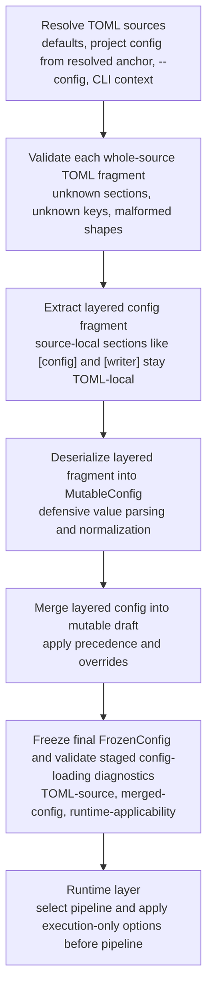

<!--
topmark:header:start

  project      : TopMark
  file         : architecture.md
  file_relpath : docs/dev/architecture.md
  license      : MIT
  copyright    : (c) 2025 Olivier Biot

topmark:header:end
-->

# Architecture Overview

This document describes key architectural decisions in TopMark that are relevant to contributors,
plugin authors, and maintainers. It focuses on *design intent* and *invariants*, not on end-user
usage.



## Canonical architecture invariants

The following architectural contracts are part of the stable 1.x design:

- CLI, API, presentation, runtime, configuration, registry, and pipeline concerns remain separated.
- Runtime execution intent is kept separate from layered configuration state.
- Pipeline command intent is selected before execution through an explicit pipeline catalogue and
  selection model. Pipeline selection is kept separate from durable runtime options: selection
  identifies the executable pipeline definition, while runtime options carry invocation state onto
  contexts and reduced results.
- Workspace-root discovery and configuration-discovery anchoring are evaluated before layered
  configuration state is constructed.
- File type identity is normalized to canonical qualified keys once resolved.
- Filesystem-identity evaluation for existing processing inputs happens before runtime processing
  and includes both processing-path normalization and processing-target eligibility checks.
- Registry mutation is represented as explicit overlay state.
- Pipeline execution remains independent from presentation rendering.
- Machine-readable output remains independent from human-facing TEXT and Markdown output.
- Mutable pipeline execution state can be reduced to durable result snapshots without changing
  runner, CLI, API, or presentation behavior.
- Outcome bucketing and report-scope filtering are based on narrow status, diagnostics, and
  outcome-flag contracts. Durable \[`ProcessingResult`\][topmark.pipeline.result.ProcessingResult]
  snapshots preserve that classification state, together with reduced execution-mode metadata, so
  result-oriented consumers can classify outcomes and select report entries without retaining the
  full mutable \[`ProcessingContext`\][topmark.pipeline.context.model.ProcessingContext]. Existing
  live-context consumers remain supported while result-facing consumers migrate across the reduction
  boundary.

______________________________________________________________________

## Mutable-context to durable-result handover

TopMark uses a streaming-capable execution and reduction handover internally while preserving
batch-oriented CLI, API, presentation, and machine-output behavior. The execution layer can yield
per-file \[`ProcessingContext`\][topmark.pipeline.context.model.ProcessingContext] instances through
\[`iter_steps_for_files()`\][topmark.pipeline.engine.iter_steps_for_files]. The reduction layer can
then snapshot those mutable contexts into durable
\[`ProcessingResult`\][topmark.pipeline.result.ProcessingResult] instances through
\[`iter_processing_results()`\][topmark.pipeline.reduction.iter_processing_results], releasing
context-owned volatile view payloads immediately after snapshotting when callers do not retain
source contexts.

The batch-facing adapters remain explicit.
\[`run_steps_for_files()`\][topmark.pipeline.engine.run_steps_for_files] materializes a
\[`PipelineExecution`\][topmark.pipeline.engine.PipelineExecution] containing mutable execution
contexts for compatibility callers.
\[`reduce_processing_contexts()`\][topmark.pipeline.reduction.reduce_processing_contexts]
materializes a \[`ProcessingReduction`\][topmark.pipeline.reduction.ProcessingReduction] from an
iterable of contexts. At the runtime/API layer,
\[`run_pipeline_results()`\][topmark.api.runtime.run_pipeline_results] is the result-oriented batch
adapter for normal check/strip processing, while
\[`run_probe_pipeline_results()`\][topmark.api.runtime.run_probe_pipeline_results] provides the
probe-specific result-oriented adapter, including durable synthetic results for missing or filtered
explicit probe inputs.

This boundary is intentionally conservative:

- it introduces per-file execution and reduction iterators inside the runtime architecture;
- it does **not** make public API calls, CLI commands, JSON output, Markdown output, or summary
  generation incremental;
- it keeps output ordering, exit-code selection, report-scope filtering, public API DTO assembly,
  human rendering, JSON envelope assembly, and summary-oriented machine output on batch-compatible
  durable result collections;
- it keeps runner-owned pruning limited to between-step release of consumed volatile views, while
  final view release happens only after
  \[`ProcessingResult.from_context()`\][topmark.pipeline.result.ProcessingResult.from_context] has
  copied retained durable detail facts such as generated unified diff text;
- it makes summary, exit-code, report-scope filtering, public API DTO assembly, human rendering, and
  machine-readable payload assembly testable against durable results without requiring output-facing
  consumers to retain mutable contexts.

Report filtering is intentionally protocol-based at this boundary: both mutable contexts and durable
results expose the status, diagnostics, and outcome flags needed to decide whether an entry belongs
in an actionable, noncompliant, or all-results report view. Durable results now also carry a reduced
\[`ProcessingDetailSnapshot`\][topmark.pipeline.result.ProcessingDetailSnapshot] for detail facts
that are safe to retain after volatile context views are released. Its retained `diff_text` value is
copied from the diff view by
\[`ProcessingResult.from_context()`\][topmark.pipeline.result.ProcessingResult.from_context] without
retaining the view object, original file image, or updated file image. Presentation and
machine-readable layers then decide how to expose that retained diff text: human TEXT/Markdown
render unified diffs, JSON detail embeds per-result `diff` payloads, and NDJSON detail emits
adjacent standalone `diff` records.

The public Python API `check()` and `strip()` result packaging now consume durable
`ProcessingResult` snapshots through the result-oriented runtime path. This keeps API DTO assembly,
report filtering, write counting, diagnostics aggregation, outcome bucketing, and public diff
exposure on reduced result state rather than on live context views.

Check/strip human rendering and machine-readable payload assembly now consume durable
`ProcessingResult` snapshots, including reduced display-path state and retained diff text. Probe
rendering, probe machine output, and probe public API DTO assembly now consume durable
`ProcessingResult` snapshots carrying reduced
\[`ProbeSnapshot`\][topmark.pipeline.result.ProbeSnapshot] state. TEXT, Markdown, JSON, NDJSON, and
public API result output therefore no longer project from live
\[`ProcessingContext`\][topmark.pipeline.context.model.ProcessingContext] instances once the
reduction boundary has been crossed. Mutable contexts remain an internal runtime concern below the
reduction boundary and are no longer required by output, reporting, or API packaging consumers.
Unified diff headers generated by the patcher remain pre-reduction context consumers because they
are created while mutable views still own the planned patch content.

Comparison and patch generation also consume structured edit metadata when the current pipeline
produces a single valid planned edit. The comparer can classify these single-edit contexts as
changed from the retained \[`EditView`\][topmark.pipeline.views.EditView] without materializing the
complete original and updated file images solely for equality checks. The patcher can render the
structured unified diff for the same single-edit path directly from the planned edit and original
image view, while retaining the existing `difflib` fallback for missing, invalid, or unsupported
edit metadata. This keeps the current single-edit insertion, replacement, and removal semantics
explicit without introducing a public streaming contract or a custom multi-edit diff engine.

Pipeline halt ownership is centralized in the step lifecycle. Concrete steps set their owned status
axes and may request terminal flow control from `run()` when they detect a policy block or execution
failure. Hint emission remains diagnostic-only: `hint()` may describe the resulting state, but it
must not change halt state. \[`BaseStep`\][topmark.pipeline.steps.base.BaseStep] enforces the
lifecycle contract after `run()` by halting contexts whose primary status axis remains `PENDING`, so
"step did not set state" protection is handled consistently instead of being repeated in individual
hint helpers.

This design deliberately stops short of a streaming public API. Public and CLI consumers still see
complete result collections, and final summaries remain batch-derived. Future work can build on the
same iterator seam for truly incremental output formats, but those would be separate contract
decisions. NDJSON detail output already preserves per-result ordering by emitting result records and
adjacent diff records from durable results, while JSON envelopes and summaries remain
batch-compatible. Diff generation remains isolated behind the durable boundary and the
structured-edit metadata seam, so later performance work can evaluate reduced-window fallback
rendering or other lower-memory diff strategies without changing output-facing result contracts.

______________________________________________________________________

## High-level configuration architecture

TopMark separates configuration concerns into three layers:

- **TOML layer** (\[`topmark.toml`\][topmark.toml]):
  - workspace-root and configuration-discovery anchoring from the resolved discovery anchor
  - discovery of configuration sources
  - parsing of TOML tables
  - whole-source TOML schema validation (unknown sections / keys, malformed section shapes, missing
    known sections as INFO diagnostics)
  - resolution of source-local options (e.g. `[config].root`, `strict`)
- **Config layer** (\[`topmark.config`\][topmark.config]):
  - construction of layered configuration (`ConfigLayer`)
  - deserialization of already-validated layered config fragments into `MutableConfig`
  - merging into a mutable config draft
  - field-level merge semantics and precedence rules
- **Runtime layer** (\[`topmark.runtime`\][topmark.runtime]):
  - execution-time options (e.g. writer behavior, STDIN mode, view pruning)
  - selected pipeline invocation state copied into durable run options
  - final adjustments before pipeline execution

```mermaid
flowchart TD
    A["Resolve TOML sources<br/>defaults, project config from resolved anchor, --config, CLI context"]
    B["Validate each whole-source TOML fragment<br/>unknown sections, unknown keys, malformed shapes"]
    C["Extract layered config fragment<br/>source-local sections like [config] and [writer] stay TOML-local"]
    D["Deserialize layered fragment into MutableConfig<br/>defensive value parsing and normalization"]
    E["Merge layered config into mutable draft<br/>apply precedence and overrides"]
    F["Freeze final FrozenConfig and validate staged config-loading diagnostics<br/>TOML-source, merged-config, runtime-applicability"]
     G["Runtime layer<br/>select pipeline and apply execution-only options before pipeline"]

    A --> B --> C --> D --> E --> F --> G
```

Not all TOML-defined values become layered configuration fields. Source-local options such as
`[config].root` and `[config].strict` are resolved on the TOML side first, then applied to config
discovery and staged config-loading validation without participating in layered config merging.

Pipeline selection is also outside layered configuration. CLI and API entry points select a concrete
pipeline definition from the pipeline catalogue using the requested pipeline family (`check`,
`strip`, or `probe`) and invocation flags such as apply and diff mode.
\[`RunOptions`\][topmark.runtime.model.RunOptions] then copies the overlapping execution state from
that selection, so mutation mode and diff emission are not repeated independently by each caller.

Project-chain discovery starts from the resolved discovery anchor before configuration-source
identity is evaluated. This keeps workspace-root discovery separate from configuration-source
identity normalization and from runtime processing-target identity.

If multiple discovered or explicit configuration entries resolve to the same configuration-source
identity, TopMark keeps only the highest-precedence occurrence in the layered configuration model.
This prevents one physical configuration file from contributing multiple effective layers through
different discovery paths, explicit `--config` spelling, or symlink spelling.



Whole-source TOML schema validation happens before layered config deserialization. The staged
config-loading validation flow is shown in the diagram above:

- \[`topmark.toml`\][topmark.toml] validates the full TopMark TOML source (including `[config]`,
  `[writer]`, unknown top-level entries, malformed section shapes, and missing known sections)
- \[`topmark.config`\][topmark.config] only receives the layered config fragment
- layered config deserializers still perform defensive value parsing so API and test callers can
  pass malformed layered fragments without crashing

At the TOML layer, malformed known sections are treated as **warning-and-ignore** cases, while
missing known sections are emitted as **INFO diagnostics** so callers can distinguish "not present"
from "present but malformed" before staged config-validation semantics are applied.

The main integration point between TOML resolution and config merging is:

- \[`resolve_toml_sources_and_build_mutable_config()`\][topmark.config.resolution.bridge.resolve_toml_sources_and_build_mutable_config]



At the architecture level, this keeps public API input shapes separate from the internal mutable
configuration construction machinery used between TOML/config resolution and runtime execution.

See also:

- [`Discovery & Precedence`](../configuration/discovery.md)
- [`Configuration overview`](../configuration/index.md)
- [`Configuration schema`](configuration-schema.md)
- [`Pipelines (Concepts)`](pipelines.md#selection-and-runtime-ownership) - selection/runtime
  ownership boundary between `PipelineSelection` and `RunOptions`

______________________________________________________________________

## Registry architecture

TopMark uses explicit registry layers for file type identities, header processor identities, and
file-type-to-processor bindings.

At the architecture level, the important invariants are:

- identity registration and processor binding are separate concerns;
- file type filename rules are canonical registry matching rules, not filesystem paths;
- built-in registry data is never mutated directly;
- runtime additions and removals are represented as overlay state;
- effective registry views are composed from base registries plus overlays;
- public integrations should prefer the read-only `Registry` facade;
- advanced integrations and tests may use overlay mutation helpers deliberately.

File type `filenames` entries are normalized during `FileType` construction so registry composition,
resolution, presentation, and machine-readable output all consume canonical POSIX-style matching
rules. Exact basename rules match file names, while relative tail-subpath rules match normalized
POSIX path tails.

Detailed registry behavior, including base/overlay composition, caching, invalidation, bindings,
qualified/local file type identifiers, plugin integration, and registry CLI inspection, is
documented in [`Registry model`](registry-model.md).

See also:

- [`Registry model`](registry-model.md) - detailed registry layers, bindings, overlays, and
  identifier semantics
- [`Plugins`](plugins.md) - plugin extension points and runtime processor overlays
- [`Resolution`](resolution.md) - path-based winner selection and ambiguity policy
- [`Configuration`](../usage/configuration.md) - public file type identifier semantics

______________________________________________________________________

## File resolution diagnostics and exit-code boundaries

TopMark's file selection layer separates **selected processing inputs** from **discovery
diagnostics**. Selected processing inputs are canonical processing paths that have passed
filesystem-identity evaluation.

Filesystem-identity normalization collapses multiple path spellings that resolve to the same
filesystem target (for example a symlink and its target) before normal pipeline execution begins.
This keeps downstream pipeline steps idempotent and avoids processing the same target file more than
once through different spellings, regardless of which selected pipeline definition is executed.

Filesystem-identity eligibility checks are distinct from normalization. The pipeline engine performs
the invocation-wide hard-link guard after processing-path selection. If multiple selected processing
paths share `(st_dev, st_ino)` identity, the engine creates terminal per-file contexts for all
affected paths with `fs=hard-linked processing target` and leaves unrelated paths to continue
through the selected pipeline. This guard lives at the engine boundary because it needs the complete
selected file list and must behave consistently for `check`, `strip`, `probe`, and API callers.

The resolver returns a structured file-list resolution result containing:

- `selected` - concrete files that should enter the processing or probe pipeline
- `missing_literals` - explicit literal input paths that do not exist
- `unmatched_patterns` - glob patterns that matched no files

This distinction is important because not every discovery outcome should become a pipeline input:

- Explicit missing literal paths are hard user input errors and are represented as synthetic
  pipeline contexts with \[`FsStatus.NOT_FOUND`\][topmark.pipeline.status.FsStatus].

By contrast, invalid command/option combinations and inappropriate STDIN modes are rejected earlier
by the CLI layer as usage errors. They are not represented as synthetic contexts because no valid
file-selection request exists yet.

The public Python API mirrors this boundary for probe diagnostics and content-processing results.
\[`topmark.api.check()`\][topmark.api.commands.pipeline.check],
\[`topmark.api.strip()`\][topmark.api.commands.pipeline.strip], and
\[`topmark.api.probe()`\][topmark.api.commands.pipeline.probe] reduce completed contexts to durable
\[`ProcessingResult`\][topmark.pipeline.result.ProcessingResult] snapshots before assembling stable
public DTOs. Check/strip use these snapshots for \[`RunResult`\][topmark.api.types.RunResult]
assembly and CLI machine output. Probe uses reduced
\[`ProbeSnapshot`\][topmark.pipeline.result.ProbeSnapshot] state for stable public DTOs
(\[`ProbeRunResult`\][topmark.api.types.ProbeRunResult],
\[`ProbeFileResult`\][topmark.api.types.ProbeFileResult], and
\[`ProbeCandidateInfo`\][topmark.api.types.ProbeCandidateInfo]), human output, and JSON/NDJSON
machine output rather than projecting from raw pipeline contexts or resolver objects.

- Unmatched glob patterns are soft discovery diagnostics for processing commands
  ([`check`](../usage/commands/check.md), [`strip`](../usage/commands/strip.md)).
- [`probe`](../usage/commands/probe.md) treats unmatched glob patterns and explicit
  discovery-filtered inputs as filtered semantic outcomes because its purpose is to explain
  resolution and filtering.

Synthetic execution contexts are built for resolver-level hard failures that occur before normal
pipeline execution can begin, then reduced to durable results at the same runtime boundary as normal
pipeline contexts. This keeps human output, machine-readable output, summaries, and exit-code
selection based on the same result collection instead of requiring separate side channels.

For probe specifically, TopMark also creates durable synthetic probe results for explicit inputs
filtered before file-type resolution. Missing explicit paths remain hard filesystem/input errors;
they are not also emitted as filtered probe results. This keeps the public API and CLI probe output
from reporting the same path twice.

Exit-code selection is centralized after pipeline execution by summarizing result statuses. The CLI
layer remains responsible for process-level exit behavior, while pipeline and presentation layers
remain Click-free and do not call `ctx.exit()`.

Practical consequences:

- Hard filesystem and input errors take precedence over semantic outcomes such as unsupported file
  types or dry-run would-change signals.
- Missing explicit inputs are visible as per-file errors instead of being collapsed into "no files
  to process".
- Hard-linked selected processing paths are visible as per-file policy-blocked results instead of
  being collapsed into a preferred source, target, winner, or loser path.
- Machine payloads expose structured diagnostics and results, while process status remains external
  as the CLI exit code.
- Public probe API payloads expose normalized strings and DTOs. Internal resolver enums,
  `ResolutionProbeResult`, and
  \[`ProcessingContext`\][topmark.pipeline.context.model.ProcessingContext] remain implementation
  details.

______________________________________________________________________

## Policy resolution

TopMark constructs a \[`PolicyRegistry`\][topmark.config.policy.PolicyRegistry] at pipeline
bootstrap time and resolves runtime policy from **global defaults + per-file-type overrides** before
pipeline steps query policy behavior.

See also:

- [`Configuration discovery`](../configuration/discovery.md)
- [`Machine-readable output schema`](../usage/machine-output.md)

This guarantees:

- Deterministic effective policy selection
- No per-context ad-hoc merging
- Clear separation between policy evaluation and status axes
- Stable, testable behavior for empty and empty-like files

The runtime model now distinguishes three related concepts:

- **true empty**: a 0-byte file (\[`FsStatus.EMPTY`\][topmark.pipeline.status.FsStatus])
- **logically empty**: a placeholder image with no meaningful content after BOM stripping (for
  example BOM-only, newline-only, or optional horizontal whitespace with at most one trailing
  newline)
- **effectively empty**: a decoded image containing no non-whitespace characters, even if it spans
  multiple blank lines

These are represented in the processing context via:

- `is_logically_empty`
- `is_effectively_empty`
- `is_empty_like`

Policy evaluation for insertion uses the configured
\[`EmptyInsertMode`\][topmark.config.policy.EmptyInsertMode], which controls which class of "empty"
files is eligible for insertion when
\[`allow_header_in_empty_files`\][topmark.config.policy.FrozenPolicy] is enabled.

The canonical policy helpers live in
\[`topmark.pipeline.context.policy`\]\[topmark.pipeline.context.policy\]:

- \[`is_empty_for_insert(ctx)`\][topmark.pipeline.context.policy.is_empty_for_insert]
- \[`allow_insert_into_empty_like(ctx)`\][topmark.pipeline.context.policy.allow_insert_into_empty_like]
- \[`is_empty_for_insert_unchanged_by_default(ctx)`\][topmark.pipeline.context.policy.is_empty_for_insert_unchanged_by_default]
- \[`can_change(ctx)`\][topmark.pipeline.context.policy.can_change]

This keeps step-level gating and outcome bucketing consistent with the same policy interpretation.

### Empty-image handling and idempotence

A major source of subtle bugs in TopMark was the difference between:

- a file that is truly empty on disk, and
- a file that is *empty-like* in the decoded image (for example `"\r\n"` or a BOM-only file).

The current design treats this distinction explicitly:

- \[`FsStatus.EMPTY`\][topmark.pipeline.status.FsStatus] is reserved for true 0-byte files
- reader-computed flags describe logical/effective emptiness for decoded images
- planner and stripper normalize placeholder images conservatively so that insert → strip → insert
  remains stable

This matters especially for:

- newline-only placeholders
- BOM-only files
- newline-style preservation (`LF` vs `CRLF`)
- policy decisions around whether insertion into empty-like files is allowed

The practical consequence is that newline semantics and placeholder images are preserved without
collapsing all empty-like cases to the same filesystem status.

### Line-ending support contract

For 1.0, TopMark intentionally recognizes only the standard physical newline styles used by text
files:

- LF (`\n`)
- CRLF (`\r\n`)
- CR (`\r`)

The sniffer and reader both use this same contract. These standard newline styles are counted for
newline-style detection, mixed-newline diagnostics, and write preservation. When a file uses one
standard style consistently, TopMark preserves that style in generated headers, planned edits,
patches, and writes. Files with mixed recognized newline styles are blocked by the existing
mixed-line-ending guard rather than normalized implicitly.

Non-standard Unicode separators such as NEL (`U+0085`), Line Separator (`U+2028`), and Paragraph
Separator (`U+2029`) are not supported physical line-ending styles. They are treated as ordinary
text content and do not contribute to newline histograms, dominant-newline detection, or
mixed-newline diagnostics.

This contract is global for built-in file types. It is not currently configurable through file-type
policy or runtime policy. XML-specific checks may still treat non-standard newline-like characters
near XML insertion boundaries as an idempotence risk and skip mutation conservatively; that is a
local safety guard, not extended newline support.

______________________________________________________________________

## Presentation and machine-readable output boundaries

TopMark separates human-facing presentation from machine-readable output.

Human-facing presentation is split into two intentionally different formats:

- **TEXT output** is console-oriented. It may use `-v` / `--verbose` for progressive disclosure and
  semantic styling when color is enabled. Commands that still have a useful status, inspection, or
  mutation signal may also expose `-q` / `--quiet` for TEXT output suppression.
- **Markdown output** is document-oriented. It ignores TEXT-only verbosity, quiet, and styling
  controls and instead renders stable Markdown suitable for documentation, CI logs, and issue
  reports.

Machine-readable formats (`json`, `ndjson`) are separate from both human formats. They are
schema-driven, never include ANSI styling, and are unaffected by TEXT-only verbosity controls.
Machine-readable projection depth is controlled by explicit machine-facing options such as `--long`,
not by `-v` / `--verbose` or `-q` / `--quiet`.

Machine-readable output is also intentionally decoupled from process exit codes. JSON and NDJSON
payloads serialize structured results, diagnostics, and resolution state; they do not embed the CLI
exit code. Consumers must inspect the process exit status separately from parsing machine payloads.

Diff output follows the same boundary. Human TEXT and Markdown output render retained diffs as
unified diff text for review. Machine-readable detail output exposes retained diffs as structured
payloads instead: JSON embeds an optional per-result `diff` object, while NDJSON emits an adjacent
standalone `diff` record after the corresponding `result` record. Machine-readable summary output
suppresses per-file diff payloads and emits a warning when `--diff` is requested.

Path representation follows the same separation between machine-facing serialization and
human-facing presentation:

- Workspace-root discovery uses the resolved discovery anchor to find project configuration sources
  before configuration-source identity and layered provenance are evaluated.
- Internal filesystem identity for existing processing inputs is evaluated before runtime
  processing. Normalized processing paths represent eligible resolved processing targets where
  possible.
- Symlink spelling is not preserved for processing identity, generated filesystem-related header
  metadata, or machine-readable path fields.
- Hard-linked selected processing paths remain separate results and are reported as unsupported,
  policy-blocked processing targets rather than being serialized as a single preferred path.
- Machine-readable filesystem path fields are serialized with POSIX `/` separators on all platforms,
  including processing, probe, configuration, and TOML/config provenance payloads.
- Header metadata path fields describe the selected processing target and are serialized with POSIX
  `/` separators when TopMark renders headers.
- Path serialization is a presentation contract layered on top of processing-path selection; it does
  not define filesystem identity by itself.
- Registry `filenames` entries are POSIX-style matching rules, not filesystem paths.
- Synthetic configuration-source identifiers are stable labels, not filesystem paths.
- TEXT and Markdown output use shared display-path helpers so regular paths follow human-facing
  display policy and STDIN-backed processing shows the logical `--stdin-filename` when available.
- TEXT and Markdown pipeline summaries share format-neutral summary preparation for file-type
  labels, result buckets, write/diff markers, and diagnostic triage. Format-specific renderers
  remain responsible for terminal styling, Markdown escaping, verbosity-specific nudges, and
  document structure.
- Unified diff file labels are human-facing display labels. They are not machine-readable path
  serialization fields and should not be treated like JSON or NDJSON path values.

### CLI applicability and usage-error boundary

CLI command applicability is enforced before pipeline execution and before presentation or machine
payload construction. Path-processing commands ([`check`](../usage/commands/check.md),
[`strip`](../usage/commands/strip.md), and [`probe`](../usage/commands/probe.md)) share input
discovery, filtering, configuration loading, file-type resolution, and STDIN content handling, but
they expose different mutation and reporting controls according to command intent. The Python API
keeps the same command-intent separation through
\[`topmark.api.check()`\][topmark.api.commands.pipeline.check],
\[`topmark.api.strip()`\][topmark.api.commands.pipeline.strip], and
\[`topmark.api.probe()`\][topmark.api.commands.pipeline.probe].

For path-processing commands, command applicability and pipeline selection are resolved before
runtime execution. The selected
\[`PipelineSelection`\][topmark.pipeline.pipelines.PipelineSelection] records the executable
pipeline definition for that invocation, while \[`RunOptions`\][topmark.runtime.model.RunOptions]
carries durable execution metadata such as pipeline kind, mutation mode, diff emission, STDIN mode,
writer behavior, and view-pruning policy onto processing contexts and reduced results.

Important invariants:

- [`check`](../usage/commands/check.md) may compare, render, plan, preview, and mutate headers when
  `--apply` is provided. The user-facing `--apply` and `--diff` options are mutually exclusive.
- [`strip`](../usage/commands/strip.md) shares file input, reporting, diff preview, and write
  behavior with [`check`](../usage/commands/check.md), but is removal-only and rejects
  generated-header insertion/update controls. The user-facing `--apply` and `--diff` options are
  mutually exclusive.
- [`probe`](../usage/commands/probe.md) shares file input and filtering behavior with
  [`check`](../usage/commands/check.md) and [`strip`](../usage/commands/strip.md), but is read-only
  and diagnostic-only. The CLI rejects mutation, patch-planning, reporting-summary, diff, and
  generated-header rendering controls. The Python API exposes no mutation or diff parameters for
  \[`probe()`\][topmark.api.commands.pipeline.probe].
- File-agnostic commands ([`version`](../usage/commands/version.md), registry commands,
  [`config defaults`](../usage/commands/config/defaults.md), and
  [`config init`](../usage/commands/config/init.md)) reject positional paths and file-processing
  STDIN modes. They also do not participate in project config discovery unless explicitly
  documented.

TopMark intentionally uses the POSIX-style `-` PATH sentinel for content read from STDIN, together
with `--stdin-filename` so file type, processor, and path-sensitive policy resolution remain the
same as for real file paths. There is no `--stdin` option flag; known unsupported option spellings
that survive permissive path-command parsing are rejected with actionable CLI usage errors before
input planning can treat them as literal paths.

These applicability failures are CLI usage errors. They do not become pipeline contexts, file
statuses, hints, reports, or machine-readable output payload entries. This preserves the separation
between:

- CLI parsing and command applicability
- file discovery and resolution diagnostics
- pipeline execution results
- presentation and machine-readable output rendering

### Human presentation and report rendering

Human presentation modules follow a shared pattern: CLI commands build Click-free, typed report
objects in \[`topmark.presentation.shared`\][topmark.presentation.shared], then pass those reports
to TEXT or Markdown renderers. This keeps renderer behavior testable and prevents Click state,
console objects, and I/O from leaking into the presentation layer. The CLI layer is responsible for
validating command applicability before those report objects are built.

Primary/headline hint selection is also a presentation concern. Hints and statuses are structured
diagnostics, but the exact hint chosen as the headline, and the ordering of secondary hints in human
output, are not part of the stable 1.x CLI contract.

Practical consequences:

- Do not parse TEXT or Markdown output in automation; use JSON/NDJSON instead.
- Do not infer process success solely from JSON/NDJSON payloads; inspect the CLI exit code.
- Use `--long` for data/detail depth where supported.
- Use `-v` only as a TEXT progressive-disclosure control.
- Use `--quiet` only on commands that explicitly support TEXT output suppression; pure informational
  content-producing commands intentionally do not expose it.
- Do not expose internal report model names in user-facing usage documentation.
- Keep command-specific option applicability checks in the CLI layer; presentation and machine
  projection code should only receive valid command/report combinations.
- Treat unsupported command/option combinations as usage errors, not as pipeline hints or synthetic
  file diagnostics.

TopMark exposes configuration state through both human-readable and machine-readable interfaces:

- Human-facing configuration commands:
  - [`config dump`](../usage/commands/config/dump.md) (resolved config)
  - [`config defaults`](../usage/commands/config/defaults.md) (built-in default TOML document)
  - [`config init`](../usage/commands/config/init.md) (bundled example TOML resource)
- Machine-readable formats:
  - JSON / NDJSON snapshots described in [`machine-output.md`](../usage/machine-output.md)

For [`config check`](../usage/commands/config/check.md), machine-readable output reports effective
strictness under the key `strict`, reflecting TOML-resolved strictness plus any CLI/API override.
This strictness applies across staged config-loading validation: TOML-source diagnostics,
merged-config diagnostics, and runtime-applicability diagnostics. Machine-readable output exposes
the flattened compatibility diagnostics view derived from those staged validation logs.

For 1.0, this flattened compatibility form is the stable machine-readable contract for config/TOML
validation diagnostics. Stage-local validation structure remains internal and is not serialized in
machine-readable formats; the emitted diagnostic entry shape remains `{level, message}`.

In machine-readable formats, [`config defaults`](../usage/commands/config/defaults.md) and
[`config init`](../usage/commands/config/init.md) share the same underlying configuration snapshot,
even though their human-facing output differs.

The same separation applies to pipeline and registry output: TEXT output may use console-oriented
verbosity, Markdown output remains document-oriented, and JSON/NDJSON output remains the stable
programmatic interface.

More generally, TopMark treats staged validation logs as the internal representation of
config-validation diagnostics. For 1.0, staged validation remains internal, and flattening is
performed only at exception, presentation, machine-readable output, and API boundaries.

______________________________________________________________________

## Related architecture and reference pages

This page focuses on cross-cutting architectural decisions such as registry design, configuration
layering, policy resolution, presentation boundaries, and the relationship between human-facing and
machine-facing interfaces.

- [`Pipelines (Concepts)`](./pipelines.md) - conceptual overview of the pipeline catalogue, pipeline
  selection, phases, and step responsibilities
- [`Pipelines (Reference)`](./pipelines-reference.md) - curated entry point into the generated
  internal API reference for pipelines and steps
- [`Terminology and Canonical Vocabulary`](../terminology.md) - canonical definitions for stable
  developer documentation terms
- [`Registry model`](./registry-model.md) - registry layers, bindings, overlays, and identifier
  semantics
- [`Header placement rules`](../usage/header-placement.md) - user-facing placement behavior and
  insertion rules
- [`Configuration overview`](../configuration/index.md) - configuration entry point and links to
  discovery/merge semantics
- [`Discovery & Precedence`](../configuration/discovery.md) - layered config discovery, root
  semantics, and precedence
- [`Machine-readable output schema`](../usage/machine-output.md) - JSON / NDJSON envelope and
  payload shapes
- [`Configuration schema`](./configuration-schema.md) - documented TOML schema and key placement
  rules

Registry design is documented in [`Registry model`](registry-model.md) because it underpins test
isolation, plugin extensibility, file type identifier semantics, and API stability.

______________________________________________________________________

**Summary:** TopMark keeps stable user-facing behavior deterministic by separating configuration
loading, registry composition, resolver decisions, policy resolution, pipeline selection, pipeline
execution, presentation, and machine-readable output into explicit layers.
