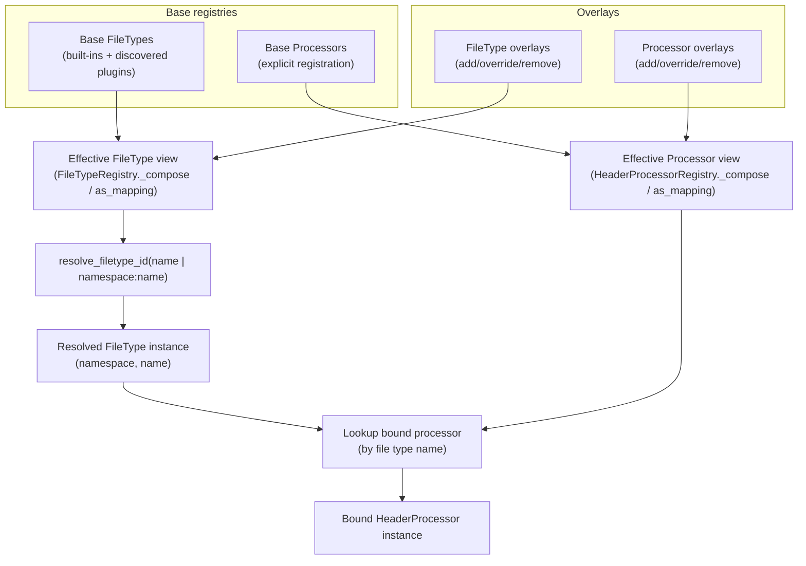
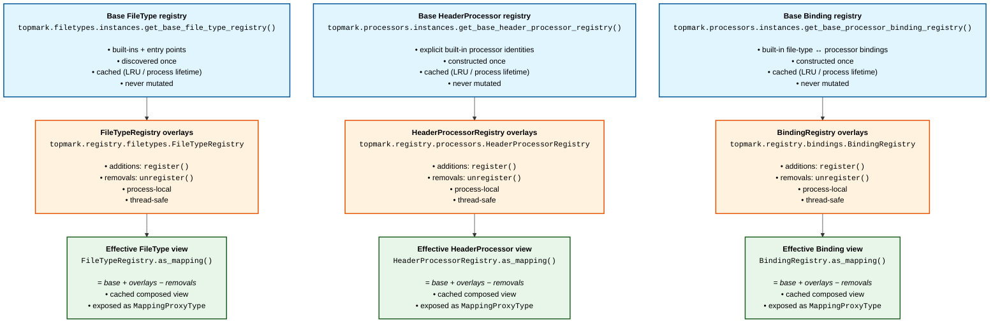
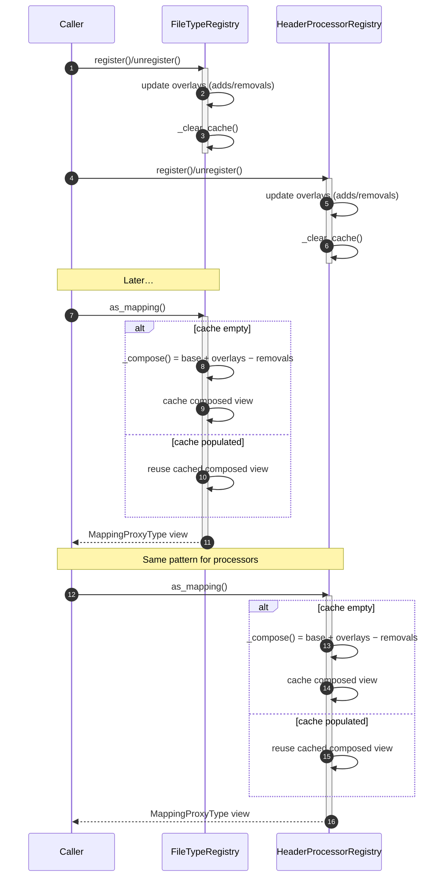
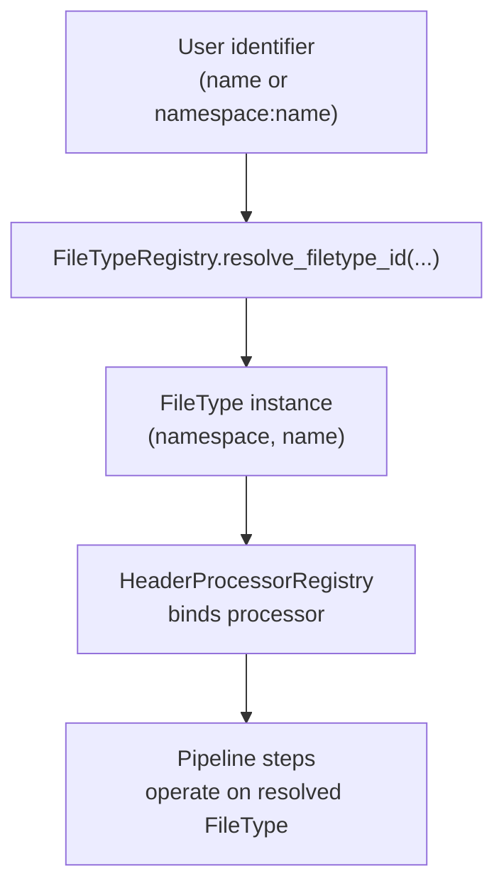

<!--
topmark:header:start

  project      : TopMark
  file         : architecture.md
  file_relpath : docs/dev/architecture.md
  license      : MIT
  copyright    : (c) 2025 Olivier Biot

topmark:header:end
-->

# Architecture Overview

This document describes key architectural decisions in TopMark that are relevant to contributors,
plugin authors, and maintainers. It focuses on *design intent* and *invariants*, not on end-user
usage.

______________________________________________________________________

## High-level configuration architecture

TopMark separates configuration concerns into three layers:

- **TOML layer** (`topmark.toml`):
  - discovery of configuration sources
  - parsing of TOML tables
  - resolution of source-local options (e.g. `[config].root`, strictness)
- **Config layer** (`topmark.config`):
  - construction of layered configuration (`ConfigLayer`)
  - merging into a mutable config draft
  - field-level merge semantics and precedence rules
- **Runtime layer** (`topmark.runtime`):
  - execution-time options (e.g. writer behavior)
  - final adjustments before pipeline execution

The main integration point between TOML resolution and config merging is:

- \[`resolve_toml_sources_and_build_config_draft()`\][topmark.config.resolution.resolve_toml_sources_and_build_config_draft]

See also:

- [`Discovery & Precedence`](../configuration/discovery.md)
- [`Configuration overview`](../configuration/index.md)

______________________________________________________________________

## Registries: Base + Overlay Design

### Problem Statement

TopMark needs to manage two extensible concepts:

- **File types** (how files are detected and classified)
- **Header processors** (how headers are inserted/updated/removed)

Early implementations relied on *process-global mutable registries* populated from built-ins and
entry-point discovery. This caused several issues:

- Tests that mutated registries leaked state into later tests
- Plugin discovery was expensive and order-dependent
- There was no clear separation between **introspection** and **mutation**
- It was difficult to provide deterministic registries in unit tests

### Design Goals

The current registry architecture was introduced to satisfy these goals:

1. **Deterministic behavior**
   - The same inputs must produce the same results regardless of test order.
1. **Safe extensibility**
   - Plugins and tests must be able to add or remove entries without mutating built-ins.
1. **Clear public vs. internal API**
   - Most users should *inspect* registries, not mutate them.
1. **Efficient composition**
   - Internal base registries should be constructed once and cached.
1. **Test isolation**
   - Registry mutations must be easy to reset between tests.
1. **Single source of truth for reference docs**
   - Generated docs should reflect the *actual* registries and wiring used by the running TopMark
     version.

### Registry System Architecture

The registry system is intentionally layered: immutable base registries are composed with mutable
overlay state to produce a cached, read-only effective view.

The composed (“effective”) registries are formed by combining base registries with
overlays/removals, and resolution happens against that effective view.


```mermaid
flowchart TB
    subgraph BASE[Base registries]
        BFT["Base FileTypes<br/>(built-ins + discovered plugins)"]
        BPR["Base Processors<br/>(explicit registration)"]
    end

    subgraph OVER[Overlays]
        OFT["FileType overlays<br/>(add/override/remove)"]
        OPR["Processor overlays<br/>(add/override/remove)"]
    end

    BFT --> EFT["Effective FileType view<br/>(FileTypeRegistry._compose / as_mapping)"]
    OFT --> EFT

    BPR --> EPR["Effective Processor view<br/>(HeaderProcessorRegistry._compose / as_mapping)"]
    OPR --> EPR

    EFT --> RES["resolve_filetype_id(name | namespace:name)"]
    RES --> FT["Resolved FileType instance<br/>(namespace, name)"]

    %% Processor selection is a lookup against the effective processor view
    FT --> LOOKUP["Lookup bound processor<br/>(by file type name)"]
    EPR --> LOOKUP
    LOOKUP --> PROC["Bound HeaderProcessor instance"]
```

Registry data is now split into three conceptual layers:

- **FileType registry**: defines canonical file type identities and matching metadata.
- **HeaderProcessor registry**: defines canonical processor identities and comment-delimiter
  capabilities.
- **Binding registry**: defines effective file-type-to-processor relationships.

The first two registries describe *what exists*; the binding registry describes *how those
identities are wired together*.


```mermaid
graph TD
    %% Base registries (built-ins + entry points)
    BFT["<b>Base FileType registry</b><br/><code>topmark.filetypes.instances.get_base_file_type_registry()</code><br/><br/>• built-ins + entry points<br/>• discovered once<br/>• cached (LRU / process lifetime)<br/>• never mutated"]
    BHP["<b>Base HeaderProcessor registry</b><br/><code>topmark.processors.instances.get_base_header_processor_registry()</code><br/><br/>• explicit built-in processor identities<br/>• constructed once<br/>• cached (LRU / process lifetime)<br/>• never mutated"]
    BBD["<b>Base Binding registry</b><br/><code>topmark.processors.instances.get_base_processor_binding_registry()</code><br/><br/>• built-in file-type ↔ processor bindings<br/>• constructed once<br/>• cached (LRU / process lifetime)<br/>• never mutated"]

    %% Overlay state (process-local)
    OFT["<b>FileTypeRegistry overlays</b><br/><code>topmark.registry.filetypes.FileTypeRegistry</code><br/><br/>• additions: <code>register()</code><br/>• removals: <code>unregister()</code><br/>• process-local<br/>• thread-safe"]
    OHP["<b>HeaderProcessorRegistry overlays</b><br/><code>topmark.registry.processors.HeaderProcessorRegistry</code><br/><br/>• additions: <code>register()</code><br/>• removals: <code>unregister()</code><br/>• process-local<br/>• thread-safe"]
    OBD["<b>BindingRegistry overlays</b><br/><code>topmark.registry.bindings.BindingRegistry</code><br/><br/>• additions: <code>register()</code><br/>• removals: <code>unregister()</code><br/>• process-local<br/>• thread-safe"]

    %% Composed effective views
    EFT["<b>Effective FileType view</b><br/><code>FileTypeRegistry.as_mapping()</code><br/><br/><i>= base + overlays − removals</i><br/>• cached composed view<br/>• exposed as <code>MappingProxyType</code>"]
    EHP["<b>Effective HeaderProcessor view</b><br/><code>HeaderProcessorRegistry.as_mapping()</code><br/><br/><i>= base + overlays − removals</i><br/>• cached composed view<br/>• exposed as <code>MappingProxyType</code>"]
    EBD["<b>Effective Binding view</b><br/><code>BindingRegistry.as_mapping()</code><br/><br/><i>= base + overlays − removals</i><br/>• cached composed view<br/>• exposed as <code>MappingProxyType</code>"]

    %% Composition flow
    BFT --> OFT
    BHP --> OHP
    BBD --> OBD
    OFT --> EFT
    OHP --> EHP
    OBD --> EBD

    classDef base fill:#e1f5fe,stroke:#01579b,stroke-width:2px,color:#000;
    classDef overlay fill:#fff3e0,stroke:#e65100,stroke-width:2px,color:#000;
    classDef view fill:#e8f5e9,stroke:#1b5e20,stroke-width:2px,color:#000;

    class BFT,BHP,BBD base;
    class OFT,OHP,OBD overlay;
    class EFT,EHP,EBD view;
```

### Public Facade vs. Advanced Registries

#### Stable Facade (Public API)

- \[`topmark.registry.registry.Registry`\][topmark.registry.registry.Registry]

This facade exposes **read-only views** of the *effective* registries and is the recommended
integration point for tooling and downstream consumers.

Characteristics:

- Immutable mappings / effective snapshots
- Read-only access to file types, processors, and bindings
- No mutation helpers
- Snapshot-tracked for API stability

#### Advanced Registries (Internal / Power-User API)

- \[`topmark.registry.filetypes.FileTypeRegistry`\][topmark.registry.filetypes.FileTypeRegistry]
- \[`topmark.registry.processors.HeaderProcessorRegistry`\][topmark.registry.processors.HeaderProcessorRegistry]
- \[`topmark.registry.bindings.BindingRegistry`\][topmark.registry.bindings.BindingRegistry]

These classes provide **overlay mutation helpers** for identities and wiring:

- `register(...)`
- `unregister(...)`

Important properties:

- Mutations affect overlays only
- Internal base-registry and plugin-discovered entries are never mutated
- Overlay changes invalidate composed-view caches automatically
- Intended for:
  - Tests
  - Plugins
  - Advanced integrations

Although these registries are snapshot-tracked for *signatures*, their **behavior** is considered
advanced and may evolve.

### Caching and Invalidation

- Base registries are cached (often via `lru_cache`) because construction and validation should only
  happen once per process.
- Composed effective views are cached for fast access.
- Any overlay mutation (`register` / `unregister`) clears the composed cache.
- Tests must reset overlays *and* caches to avoid cross-test contamination.

Overlay mutations are intentionally cheap: they only update overlay state and clear the
composed-view cache. The next call to `as_mapping()` recomposes the effective view on demand.

Separately, TopMark’s documentation site generates “Supported file types” and “Registered
processors” pages by running the CLI in Markdown mode during the MkDocs build. This keeps reference
tables aligned with the effective registries of the current version.


```mermaid
sequenceDiagram
    autonumber
    participant Caller
    participant FTR as FileTypeRegistry
    participant HPR as HeaderProcessorRegistry

    Caller->>FTR: register()/unregister()
    activate FTR
    FTR->>FTR: update overlays (adds/removals)
    FTR->>FTR: _clear_cache()
    deactivate FTR

    Caller->>HPR: register()/unregister()
    activate HPR
    HPR->>HPR: update overlays (adds/removals)
    HPR->>HPR: _clear_cache()
    deactivate HPR

    Note over Caller,FTR: Later…
    Caller->>FTR: as_mapping()
    activate FTR
    alt cache empty
        FTR->>FTR: _compose() = base + overlays − removals
        FTR->>FTR: cache composed view
    else cache populated
        FTR->>FTR: reuse cached composed view
    end
    FTR-->>Caller: MappingProxyType view
    deactivate FTR

    Note over Caller,HPR: Same pattern for processors
    Caller->>HPR: as_mapping()
    activate HPR
    alt cache empty
        HPR->>HPR: _compose() = base + overlays − removals
        HPR->>HPR: cache composed view
    else cache populated
        HPR->>HPR: reuse cached composed view
    end
    HPR-->>Caller: MappingProxyType view
    deactivate HPR
```

### Why Not Per-Run Registries?

Registries are intentionally **process-global** rather than per-run objects:

- Registry contents affect discovery, resolution, and pipeline wiring.
- Passing registries through every layer would significantly complicate APIs.
- Most users do not need per-run customization.

Instead:

- Configuration controls *which* file types are active for a run
- Registries control *what* file types and processors exist

### Non-Goals

The registry system is **not** designed to:

- Provide transactional or scoped registry mutation in production code
- Guarantee overlay behavior as a stable public contract
- Allow silent mutation of built-ins or plugin-provided entries

### Keys and schema stability

TopMark defines centralized constants for:

- **CLI spellings** (e.g. `--include-file-types`)
- **CLI destination keys** (the `dest` names Click stores in its parsed namespace)
- **TOML keys** used by the config model and default configuration

This reduces accidental drift between CLI help text, config parsing, and runtime logic. Validation
should occur at “seams” (CLI parsing and TOML loading) so internal code can rely on canonical keys.
TOML schema details are documented in [`docs/dev/config-schema.md`](config-schema.md).

## FileType identity and resolution

A `FileType` has a stable identity defined by the tuple:

```py
(namespace, name)
```

The canonical identifier form is therefore:

```text
<namespace>:<name>
```

For compatibility with existing configuration and CLI filtering, registries may still accept or
expose the *unqualified* file type name. Resolution is performed through
`FileTypeRegistry.resolve_filetype_id(...)`, which accepts both forms and returns the corresponding
`FileType` instance.

The resolution path from a user-provided identifier to a bound processor looks like this:


```mermaid
flowchart TD
    ID["User identifier<br/>(name or namespace:name)"] --> RESOLVE["FileTypeRegistry.resolve_filetype_id(...)"]
    RESOLVE --> FT["FileType instance<br/>(namespace, name)"]
    FT --> HPR["HeaderProcessorRegistry<br/>binds processor"]
    HPR --> PIPE["Pipeline steps<br/>operate on resolved FileType"]
```

Internally:

- `FileTypeRegistry` stores and validates `FileType` objects
- `HeaderProcessorRegistry` binds processors to specific `FileType` instances
- the public `Registry` facade resolves identifiers before delegating to the underlying registries

This design allows TopMark to gradually move toward fully-qualified identifiers without breaking
existing configuration or CLI usage. For the path-based winner-selection and ambiguity policy, see
[`resolution.md`](resolution.md).

### Practical Implications for Contributors

- Prefer `Registry` (facade) when reading registry contents.
- Treat file types, processors, and bindings as separate concerns:
  - file types / processors describe identities
  - bindings describe relationships
- Use overlay mutation helpers only in tests or plugin code.
- Always reset overlay state in tests that register/unregister entries.
- Treat registry internals (`_compose`, overlays, caches) as private.

______________________________________________________________________

## Policy Resolution (≥ 0.11.0)

TopMark constructs a `PolicyRegistry` at pipeline bootstrap time and resolves runtime policy from
**global defaults + per-file-type overrides** before policy queries are used by pipeline steps.

See also:

- [`Configuration discovery`](../configuration/discovery.md)
- [`Machine output schema`](machine-output.md)

This guarantees:

- Deterministic effective policy selection
- No per-context ad-hoc merging
- Clear separation between policy evaluation and status axes
- Stable, testable behavior for empty and empty-like files

The runtime model now distinguishes three related concepts:

- **true empty**: a 0-byte file (`FsStatus.EMPTY`)
- **logically empty**: a placeholder image with no meaningful content after BOM stripping (for
  example BOM-only, newline-only, or optional horizontal whitespace with at most one trailing
  newline)
- **effectively empty**: a decoded image containing no non-whitespace characters, even if it spans
  multiple blank lines

These are represented in the processing context via:

- `is_logically_empty`
- `is_effectively_empty`
- `is_empty_like`

Policy evaluation for insertion now uses the configured `EmptyInsertMode`, which controls which
class of "empty" files is eligible for insertion when `allow_header_in_empty_files` is enabled.

The canonical policy helpers live in
\[`topmark.pipeline.context.policy`\]\[topmark.pipeline.context.policy\]:

- `is_empty_for_insert(ctx)`
- `allow_insert_into_empty_like(ctx)`
- `is_empty_for_insert_unchanged_by_default(ctx)`
- `can_change(ctx)`

This keeps step-level gating and outcome bucketing consistent with the same policy interpretation.

### Empty-image handling and idempotence

A major source of subtle bugs in TopMark was the difference between:

- a file that is truly empty on disk, and
- a file that is *empty-like* in the decoded image (for example `"\r\n"` or a BOM-only file).

The current design treats this distinction explicitly:

- `FsStatus.EMPTY` is reserved for true 0-byte files
- reader-computed flags describe logical/effective emptiness for decoded images
- planner and stripper normalize placeholder images conservatively so that insert → strip → insert
  remains stable

This matters especially for:

- newline-only placeholders
- BOM-only files
- newline-style preservation (`LF` vs `CRLF`)
- policy decisions around whether insertion into empty-like files is allowed

The practical consequence is that newline semantics and placeholder images are preserved without
collapsing all empty-like cases to the same filesystem status.

## Configuration and machine output

TopMark exposes configuration state through both human-readable and machine-readable interfaces:

- Human-facing commands:
  - `config dump` (resolved config)
  - `config defaults` (built-in default TOML document)
  - `config init` (bundled example TOML resource)
- Machine formats:
  - JSON / NDJSON snapshots described in [`machine-output.md`](machine-output.md)

In machine formats, `config defaults` and `config init` share the same underlying configuration
snapshot, even though their human-facing output differs.

______________________________________________________________________

## Related architecture and reference pages

This page focuses on cross-cutting architectural decisions such as registry design, configuration
layering, policy resolution, and the relationship between human-facing and machine-facing
interfaces.

- [`Pipelines (Concepts)`](./pipelines.md) — conceptual overview of pipeline structure, phases, and
  step responsibilities
- [`Pipelines (Reference)`](./pipelines-reference.md) — curated entry point into the generated
  internal API reference for pipelines and steps
- [`Header placement rules`](../usage/header-placement.md) — user-facing placement behavior and
  insertion rules
- [`Configuration overview`](../configuration/index.md) — configuration entry point and links to
  discovery/merge semantics
- [`Discovery & Precedence`](../configuration/discovery.md) — layered config discovery, root
  semantics, and precedence
- [`Machine output schema`](./machine-output.md) — JSON / NDJSON envelope and payload shapes
- [`Config schema`](./config-schema.md) — documented TOML schema and key placement

Registry design is documented here because it underpins test isolation, plugin extensibility, and
API stability.

______________________________________________________________________

**Summary:** Overlay registries allow TopMark to remain extensible, deterministic, and testable
without sacrificing a small, stable public API surface.
