<!--
topmark:header:start

  project      : TopMark
  file         : pipelines.md
  file_relpath : docs/dev/pipelines.md
  license      : MIT
  copyright    : (c) 2025 Olivier Biot

topmark:header:end
-->

# Pipelines (Concepts)

TopMark processes files through **explicit, immutable pipelines** composed of
small, single-responsibility steps. Each pipeline represents a supported user
intent (scan, check, strip, apply, patch) and defines **exactly which steps run
and in which order**.

Pipelines do not make high-level decisions themselves. Instead:

- Each step mutates a **strictly defined set of status axes**
- Steps may **halt execution** when required by policy or safety rules
- Final outcomes (changed, unchanged, skipped, unsupported, error, …) are
  **derived centrally** by the CLI and views from accumulated statuses and hints

This design guarantees predictability, debuggability, and idempotence.

## Concepts vs Reference

This page explains **how the pipelines work** and how the CLI composes them.
For the canonical, API-backed definitions of pipelines, steps, and enums, see:

- **Pipelines (Reference hub):** [`dev/pipelines-reference.md`](./pipelines-reference.md)
- **Internals (generated):** [`api/internals/topmark/pipeline/pipelines.md`](../api/internals/topmark/pipeline/pipelines.md)

Tip: step names and enum names on this page are written as MkDocStrings/AutoRefs
links (e.g. \[`topmark.pipeline.steps.resolver.ResolverStep`\][topmark.pipeline.steps.resolver.ResolverStep]). Once the reference
page is present, MkDocs will turn those into clickable links.

______________________________________________________________________

## Pipeline Overview

All pipelines are built from the same core phases:

1. **Discovery** – identify file type and viability
1. **Inspection** – read content and detect existing headers
1. **Evaluation** – generate and compare expected headers
1. **Mutation (optional)** – plan, patch, and/or write changes

### Unified Pipeline Flow

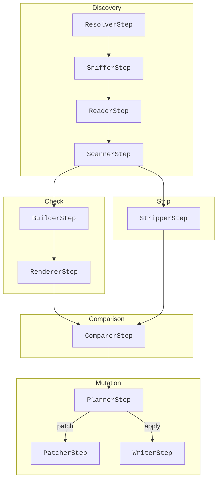

Not all pipelines traverse all phases. Each variant selects a **strict subset**
of steps.

______________________________________________________________________

## Available Pipelines

Pipelines are defined in
`src/topmark/pipeline/pipelines.py`
and exposed via the `Pipeline` enum.

### SCAN

**Purpose:** Detect file type and existing TopMark headers

**Mutation:** ❌ none

**Steps:**

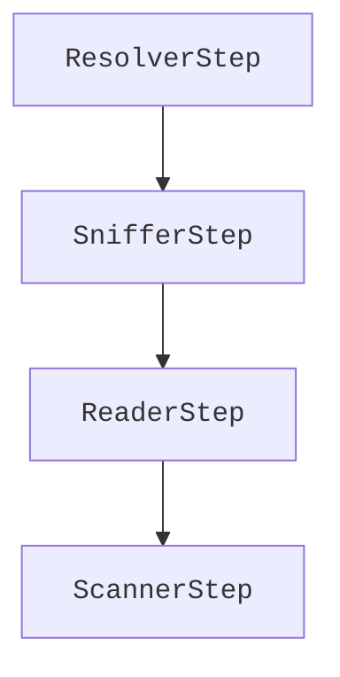

**End states:**

- Header detected / missing / malformed
- File unsupported, unreadable, binary, or blocked by policy

This pipeline is used as the foundation for all others.

______________________________________________________________________

### CHECK_RENDER

**Purpose:** Generate the expected header without comparison

**Mutation:** ❌ none

**Steps:**

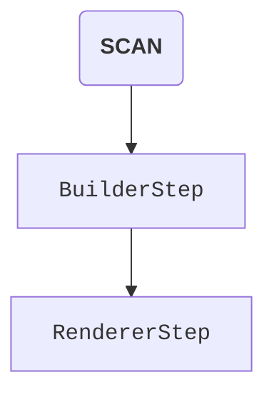

**End states:**

- Rendered header available in context
- No determination yet whether changes are needed

Useful for debugging header generation.

______________________________________________________________________

### CHECK (Summary)

**Purpose:** Determine whether a file *would* change

**Mutation:** ❌ none (dry-run safe)

**Steps:**

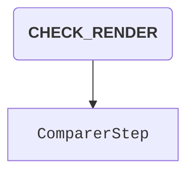

**End states:**

- `UNCHANGED` – rendered header matches existing header
- `CHANGED` – header would be updated or inserted
- `SKIPPED` / `UNSUPPORTED` – policy or file constraints

This is the default pipeline behind `topmark check`.

______________________________________________________________________

### CHECK_PATCH

**Purpose:** Produce a unified diff without writing

**Mutation:** ❌ none (dry-run safe)

**Steps:**

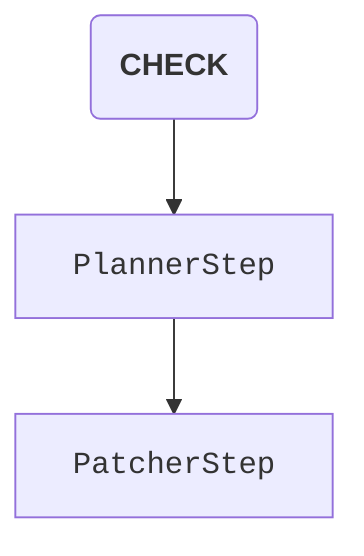

**End states:**

- Patch generated
- No patch if unchanged or skipped

Used when `--patch` is requested without `--apply`.

______________________________________________________________________

### CHECK_APPLY

**Purpose:** Update or insert headers in place

**Mutation:** ✅ writes enabled

**Steps:**

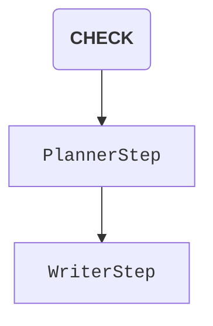

**End states:**

- File written
- Write skipped if unchanged or blocked
- Failure if filesystem or policy prevents writing

Requires `--apply`.

______________________________________________________________________

### CHECK_APPLY_PATCH

**Purpose:** Apply changes *and* emit a patch

**Mutation:** ✅ writes enabled

**Steps:**

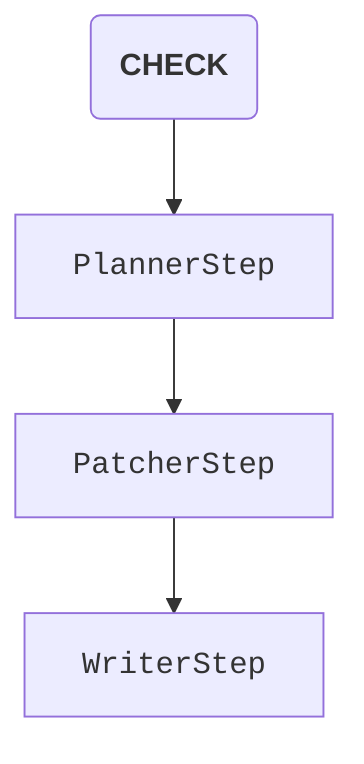

Primarily useful for CI or audit workflows.

______________________________________________________________________

### STRIP (Summary)

**Purpose:** Remove an existing TopMark header

**Mutation:** ❌ none (dry-run safe)

**Steps:**

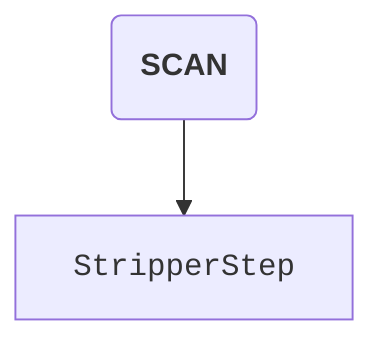

**End states:**

- Header removed in rendered output
- No-op if header absent
- Skipped if unsupported or blocked

______________________________________________________________________

### STRIP_PATCH

**Purpose:** Show diff for header removal

**Mutation:** ❌ none

**Steps:**

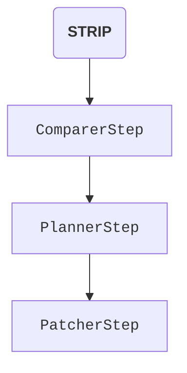

______________________________________________________________________

### STRIP_APPLY

**Purpose:** Remove headers in place

**Mutation:** ✅ writes enabled

**Steps:**

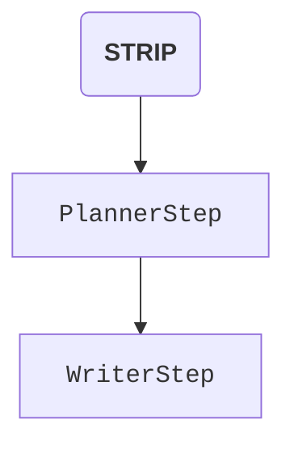

______________________________________________________________________

### STRIP_APPLY_PATCH

**Purpose:** Remove headers and emit patch

**Mutation:** ✅ writes enabled

**Steps:**

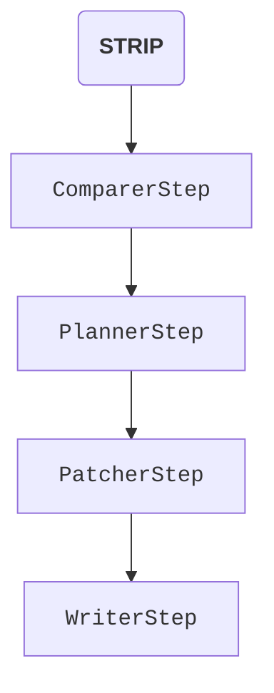

______________________________________________________________________

## Step Responsibilities

Each step implements the `Step` protocol and:

- Declares which **status axes** it may write
- May halt execution via `ctx.flow.halt`
- Emits structured hints for diagnostics

| Step                                                             | Responsibility                           |
| ---------------------------------------------------------------- | ---------------------------------------- |
| \[`ResolverStep`\][topmark.pipeline.steps.resolver.ResolverStep] | Determine file type and header processor |
| \[`SnifferStep`\][topmark.pipeline.steps.sniffer.SnifferStep]    | Fast policy and newline checks           |
| \[`ReaderStep`\][topmark.pipeline.steps.reader.ReaderStep]       | Read file content safely                 |
| \[`ScannerStep`\][topmark.pipeline.steps.scanner.ScannerStep]    | Locate existing header bounds            |
| \[`BuilderStep`\][topmark.pipeline.steps.builder.BuilderStep]    | Build expected header field values       |
| \[`RendererStep`\][topmark.pipeline.steps.renderer.RendererStep] | Render header text                       |
| \[`ComparerStep`\][topmark.pipeline.steps.comparer.ComparerStep] | Compare existing vs rendered header      |
| \[`StripperStep`\][topmark.pipeline.steps.stripper.StripperStep] | Remove header content                    |
| \[`PlannerStep`\][topmark.pipeline.steps.planner.PlannerStep]    | Decide insert / replace / remove plan    |
| \[`PatcherStep`\][topmark.pipeline.steps.patcher.PatcherStep]    | Generate unified diff                    |
| \[`WriterStep`\][topmark.pipeline.steps.writer.WriterStep]       | Persist changes                          |

______________________________________________________________________

## Conditional and Policy-Driven End States

Some pipelines may terminate early due to **policy or safety constraints**:

- Binary files
- Mixed line endings
- BOM before shebang
- Missing read/write permissions
- Unsupported file types

In these cases:

- The pipeline halts cleanly
- No mutation occurs
- A terminal hint explains *why* the file was skipped or blocked

This guarantees:

- Safe dry-runs
- No partial writes
- Idempotent behavior across repeated runs

______________________________________________________________________

## Key Design Guarantees

- **Immutability:** Pipelines are `Final[tuple[Step, ...]]`
- **Determinism:** Same input → same outcome
- **Dry-run safety:** No writes without `--apply`
- **Separation of concerns:** Steps mutate context, views classify outcomes

______________________________________________________________________

This pipeline model is the backbone of TopMark’s reliability and extensibility.
New behaviors are introduced by adding steps or composing new pipelines—never by
special-casing control flow.

______________________________________________________________________

## Per-axis lifecycle

TopMark tracks progress using a set of **status axes**. Each axis starts in
`PENDING` and transitions as steps complete or halt early.

These diagrams are intentionally coarse: they show *possible* terminal states,
not every code path.

### Resolve axis

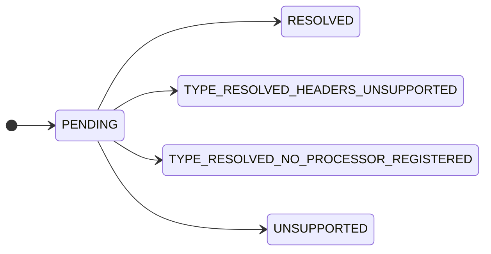

### FS axis

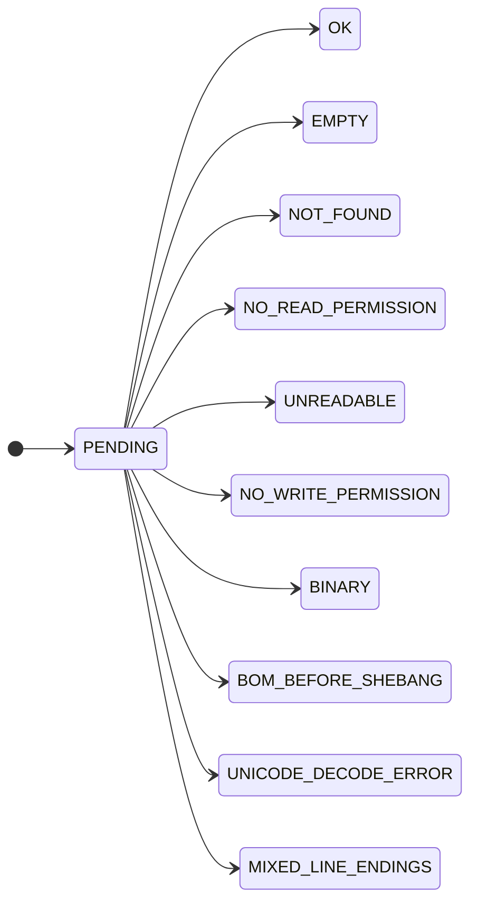

### Content axis

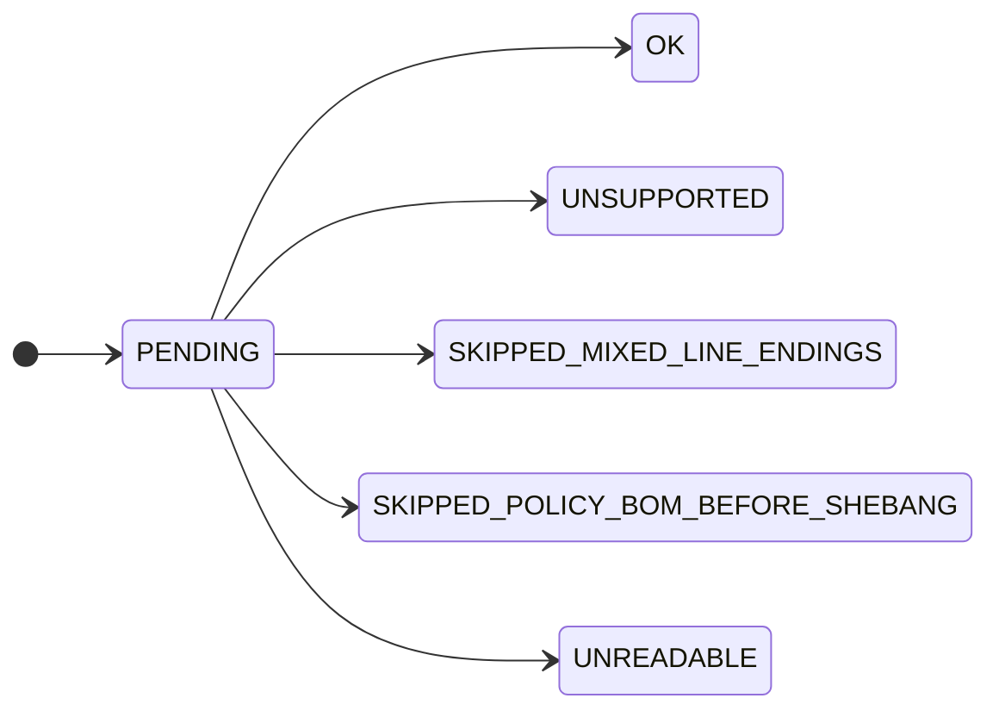

### Header axis

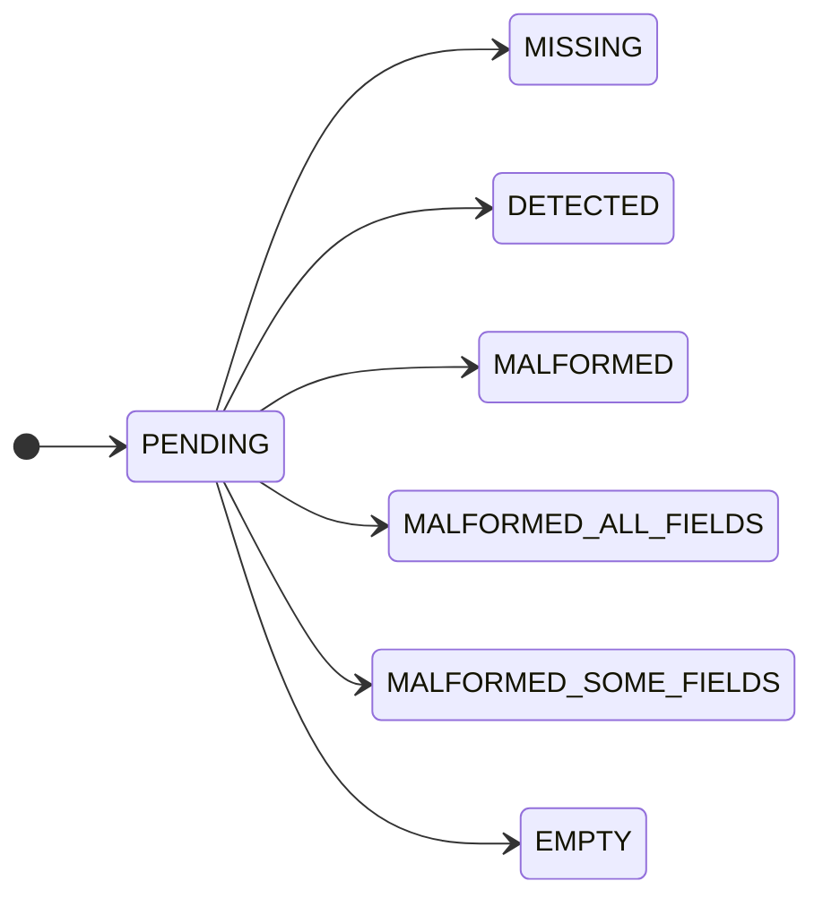

### Generation axis

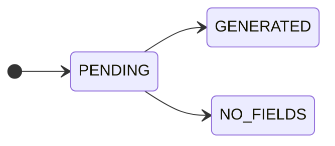

### Render axis

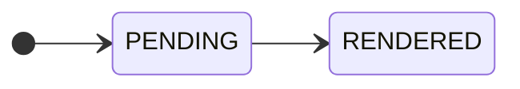

### Comparison axis

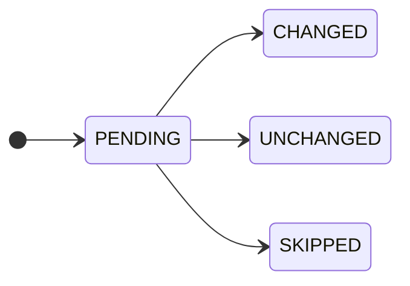

### Strip axis

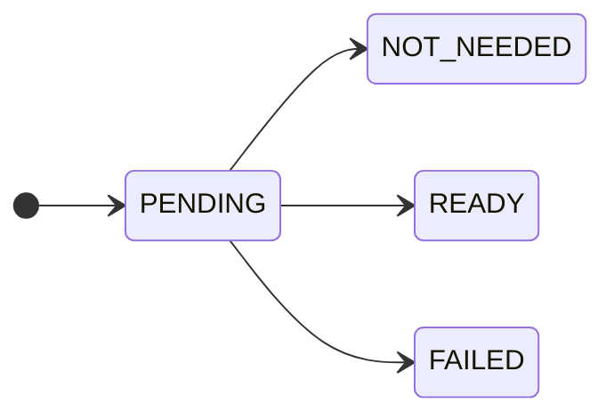

### Plan axis

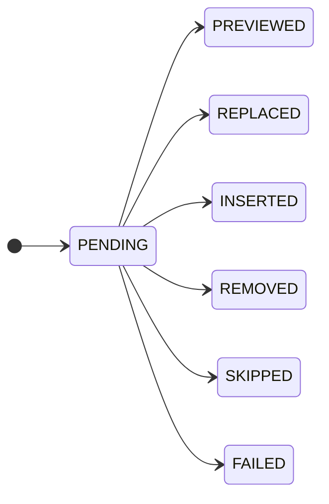

### Patch axis

```mermaid
stateDiagram-v2
  direction LR
  [*] --> PENDING
  PENDING --> GENERATED
  PENDING --> SKIPPED
  PENDING --> FAILED
```

### Write axis

```mermaid
stateDiagram-v2
  direction LR
  [*] --> PENDING
  PENDING --> WRITTEN
  PENDING --> SKIPPED
  PENDING --> FAILED
```

______________________________________________________________________

## CLI-focused flowcharts

These diagrams describe the **user-visible** execution paths behind `topmark check`
and `topmark strip`, including the `--patch` and `--apply` switches.

### `topmark check`

```mermaid
flowchart TD
  A[User runs: topmark check] --> B[SCAN: resolve + sniff + read + scan]
  B --> C[CHECK_RENDER: build + render]
  C --> D[COMPARE]
  D -->|unchanged| E[Report: unchanged]
  D -->|would change| F[Plan insert/replace]
  F -->|no --patch, no --apply| G[Report: would change]
  F -->|--patch| H[Generate patch]
  F -->|--apply| I[Write file]
  H --> J[Report: patch shown]
  I --> K[Report: written]
  B --> L[Blocked by policy/fs/content] --> M[Report: skipped/unsupported/error]
```

### `topmark strip`

```mermaid
flowchart TD
  A[User runs: topmark strip] --> B[SCAN: resolve + sniff + read + scan]
  B --> C[STRIP: compute removal]
  C --> D[COMPARE]
  D -->|nothing to remove| E[Report: no-op]
  D -->|would remove| F[Plan removal]
  F -->|no --patch, no --apply| G[Report: would remove]
  F -->|--patch| H[Generate patch]
  F -->|--apply| I[Write file]
  H --> J[Report: patch shown]
  I --> K[Report: written]
  B --> L[Blocked by policy/fs/content] --> M[Report: skipped/unsupported/error]
```
