<!--
topmark:header:start

  project      : TopMark
  file         : pipelines.md
  file_relpath : docs/dev/pipelines.md
  license      : MIT
  copyright    : (c) 2025 Olivier Biot

topmark:header:end
-->

# Pipelines (Concepts)

TopMark processes files through **explicit, immutable pipelines** composed of small,
single-responsibility steps. Each pipeline represents a supported execution intent (scan, check,
strip, apply, patch) and defines **exactly which steps run and in which order**.

A dedicated **probe pipeline** exists for resolution diagnostics
([`topmark probe`](../usage/commands/probe.md)). Probe orchestration also reports explicit inputs
filtered before file-type probing via synthetic probe contexts.

Pipelines do not make high-level decisions themselves. Instead:

- Each step mutates a **strictly defined set of status axes**
- Steps may **halt execution** when required by policy or safety rules
- Final outcomes (changed, unchanged, skipped, unsupported, error, ...) are **derived centrally** by
  the CLI and views from accumulated statuses and hints

This design guarantees predictability, debuggability, and idempotence.



Pipeline execution consumes an immutable \[`FrozenConfig`\][topmark.config.model.FrozenConfig] plus
runtime options assembled from the TOML → FrozenConfig → runtime flow documented in
[`Architecture`](architecture.md) and [`Configuration discovery`](../configuration/discovery.md).

Pipeline execution also consumes a selected **processing path**. File-list resolution performs
filesystem-identity evaluation before ordinary pipeline execution begins.

Filesystem-identity normalization collapses equivalent path spellings, such as symlinks, into a
selected processing path. Filesystem-identity eligibility checks determine whether selected
processing paths are safe to process. Pipeline steps therefore operate on processing paths rather
than preserving original CLI, configuration, glob, or symlink spellings.

Hard-linked selected processing paths are handled by an invocation-wide engine guard before ordinary
per-file pipeline execution. If multiple selected paths refer to the same filesystem object through
hard links, every affected path is blocked as an unsupported processing target; no source, target,
winner, or loser path is selected.

Source-local TOML options such as `[config].root` and `strict` are resolved before pipeline
execution. They influence configuration discovery and staged config-loading validation behavior, but
do not become layered configuration fields.



## Concepts vs Reference

This page explains **how the pipelines work** and how the CLI composes them. For the canonical,
API-backed definitions of pipelines, steps, and enums, see:

- **Pipelines reference hub:** [`Pipelines (Reference)`](./pipelines-reference.md)
- **Internals (generated):**
  [`api/internals/topmark/pipeline/pipelines.md`](../api/internals/topmark/pipeline/pipelines.md)
- **Architecture overview:** [`Architecture`](./architecture.md)

Step names and enum names on this page are written as MkDocStrings/AutoRefs links, for example
\[`topmark.pipeline.steps.resolver.ResolverStep`\][topmark.pipeline.steps.resolver.ResolverStep].
MkDocs resolves these references through the generated API documentation.

______________________________________________________________________

## Pipeline Overview

All pipelines are built from the same core phases:

1. **Input selection** - discover files, evaluate filesystem identity, normalize equivalent path
   spellings, enforce processing-target eligibility, and select processing paths
1. **Discovery** - identify file type and viability for each processing path
1. **Inspection** - read content and detect existing headers
1. **Evaluation** - generate and compare expected headers
1. **Mutation (optional)** - plan, patch, and/or write changes

The `probe` pipeline is an exception: it only executes the resolution phase and stops immediately
after producing probe results.

Input selection happens before ordinary pipeline execution. Filesystem-identity normalization
handles symlink behavior: file symlink spellings and their targets are collapsed to the resolved
processing target before pipeline steps run. Filesystem-identity eligibility checks handle safety
policy such as hard-link detection: hard-linked selected processing paths are blocked before
ordinary step execution, while unrelated selected paths continue through the requested pipeline.
Synthetic probe contexts for filtered or missing explicit inputs preserve diagnostic input
information only for those paths that never became normal processing paths.

### Unified Pipeline Flow

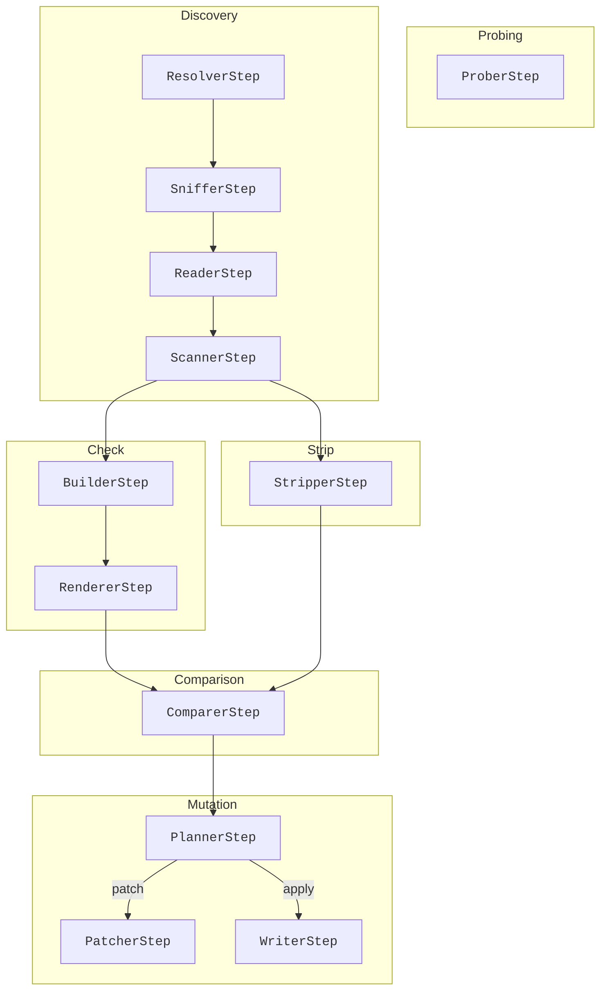
```mermaid
flowchart TD

  subgraph Probing
    O[<tt>ProberStep</tt>]
  end

  subgraph Discovery
    R[<tt>ResolverStep</tt>]
    S[<tt>SnifferStep</tt>]
    D[<tt>ReaderStep</tt>]
    N[<tt>ScannerStep</tt>]

    R --> S --> D --> N
  end

  subgraph Check
    B[<tt>BuilderStep</tt>]
    T[<tt>RendererStep</tt>]

    N --> B --> T
  end

  subgraph Strip
    X[<tt>StripperStep</tt>]

    N --> X
  end

  subgraph Comparison
    C[<tt>ComparerStep</tt>]
  end

  subgraph Mutation
    P[<tt>PlannerStep</tt>]
    H[<tt>PatcherStep</tt>]
    W[<tt>WriterStep</tt>]

    C --> P
    P -->|patch| H
    P -->|apply| W
  end

  T --> C
  X ---> C
```

Not all pipelines traverse all phases. Each variant selects a **strict subset** of steps.

______________________________________________________________________

## Pipeline guarantees

TopMark pipelines are:

- deterministic
- step-ordered
- side-effect constrained
- idempotent
- processing-path based
- presentation-independent

Pipeline steps mutate processing context state. CLI views, API DTOs, and machine-readable output
classify final outcomes from accumulated statuses and hints.

For filesystem inputs, the processing context path is the selected processing path. It may differ
from the path spelling supplied on the command line or in configuration when symlinks or equivalent
relative spellings are involved.

For hard-linked filesystem inputs, selected processing paths remain separate results but are blocked
before ordinary per-file pipeline execution. The engine does not collapse the hard-link group into a
preferred source, target, winner, or loser path.

______________________________________________________________________

## Available Pipelines

Pipelines are defined in `src/topmark/pipeline/pipelines.py` and exposed via
\[`topmark.pipeline.pipelines.Pipeline`\][topmark.pipeline.pipelines.Pipeline].

The CLI selects among these immutable pipeline variants based on command intent and flags such as
`--patch` and `--apply`.

### PROBE

**Purpose:** Explain file type and processor resolution

**Mutation:** ❌ none

**Steps:**

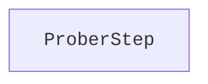
```mermaid
flowchart TD

O[<tt>ProberStep</tt>]
```

**End states:**

- Resolution status (`resolved`, `unsupported`, `no_processor`, `filtered`)

- Selected file type and processor (if any)

- Full candidate set with match signals

- Explicit inputs filtered before file-type probing are represented by synthetic probe results with
  `status="filtered"` and reasons such as `excluded_by_path_filter`, `excluded_by_file_type_filter`,
  or `excluded_by_discovery_filter`.

This pipeline powers [`topmark probe`](../usage/commands/probe.md) and
\[`topmark.api.probe()`\][topmark.api.commands.pipeline.probe] and is intentionally
**resolution-only**.

It halts immediately after probing and does not perform inspection, comparison, or mutation.
Discovery-level filtering is reported by orchestration via synthetic probe results for explicitly
requested paths that did not reach probing.

Probe results that do reach runtime probing report processing paths. They should not be interpreted
as a lossless echo of the original invocation spelling.

Hard-linked selected processing paths also remain visible in probe output. Each affected path is
reported independently as unsupported with the stable reason string `hard_link_duplicate`.

### SCAN

**Purpose:** Detect file type and existing TopMark headers

**Mutation:** ❌ none

**Steps:**

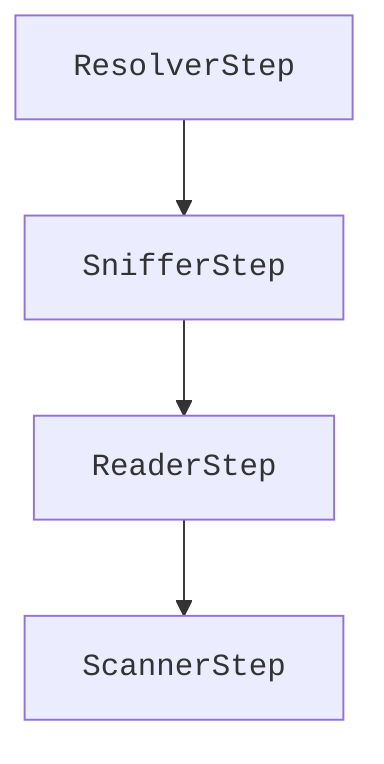
```mermaid
flowchart TD

R[<tt>ResolverStep</tt>]
S[<tt>SnifferStep</tt>]
D[<tt>ReaderStep</tt>]
N[<tt>ScannerStep</tt>]

R --> S --> D --> N
```

**End states:**

- Header detected / missing / malformed
- File unsupported, unreadable, binary, or blocked by policy
- Hard-linked processing target blocked before ordinary scan steps run

This pipeline is used as the foundation for all others.

______________________________________________________________________

### CHECK_RENDER

**Purpose:** Generate the expected header without comparison

**Mutation:** ❌ none

**Steps:**

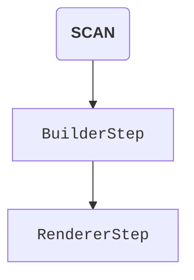
```mermaid
flowchart TD

SP(<b>SCAN</b>)
B[<tt>BuilderStep</tt>]
T[<tt>RendererStep</tt>]

SP --> B --> T
```

**End states:**

- Rendered header available in context
- No determination yet whether changes are needed

`BuilderStep` derives built-in header metadata fields such as `file_relpath`, `file_abspath`,
`relpath`, and `abspath` from the selected processing target. If a file was reached through a
symlink, these generated fields describe the resolved target TopMark reads and writes rather than
the symlink spelling. Header metadata path fields are serialized with POSIX `/` separators on all
platforms.

Useful for debugging header generation.

______________________________________________________________________

### CHECK (Summary)

**Purpose:** Determine whether a file *would* change

**Mutation:** ❌ none (dry-run safe)

**Steps:**

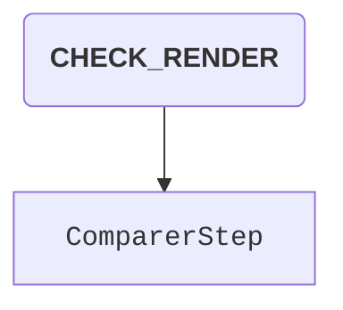
```mermaid
flowchart TD

CR(<b>CHECK_RENDER</b>)
C[<tt>ComparerStep</tt>]

CR --> C
```

**End states:**

- `UNCHANGED` - rendered header matches existing header
- `CHANGED` - header would be updated or inserted
- `SKIPPED` / `UNSUPPORTED` - policy or file constraints

This is the default pipeline behind [`topmark check`](../usage/commands/check.md).

______________________________________________________________________

### CHECK_PATCH

**Purpose:** Produce a unified diff without writing

**Mutation:** ❌ none (dry-run safe)

**Steps:**

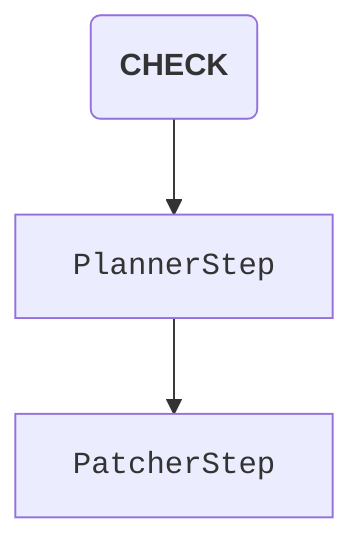
```mermaid
flowchart TD

CP(<b>CHECK</b>)
P[<tt>PlannerStep</tt>]
H[<tt>PatcherStep</tt>]

CP --> P --> H
```

**End states:**

- Patch generated
- No patch if unchanged or skipped

`PatcherStep` generates unified diffs for human review. Diff file labels use the same human-facing
display-path policy as TEXT and Markdown reports, including the logical `--stdin-filename` for
STDIN-backed processing when available. They are not machine-readable path serialization fields.

Used when `--patch` is requested without `--apply`.

______________________________________________________________________

### CHECK_APPLY

**Purpose:** Update or insert headers in place

**Mutation:** ✅ writes enabled

**Steps:**

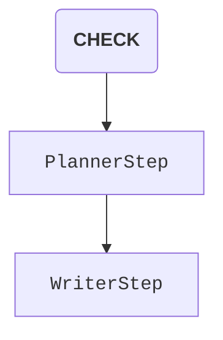
```mermaid
flowchart TD

CP(<b>CHECK</b>)
P[<tt>PlannerStep</tt>]
W[<tt>WriterStep</tt>]

CP --> P --> W
```

**End states:**

- File written
- Write skipped if unchanged or blocked
- Failure if filesystem or policy prevents writing

Requires `--apply`.

______________________________________________________________________

### CHECK_APPLY_PATCH

**Purpose:** Apply changes *and* emit a patch

**Mutation:** ✅ writes enabled

**Steps:**

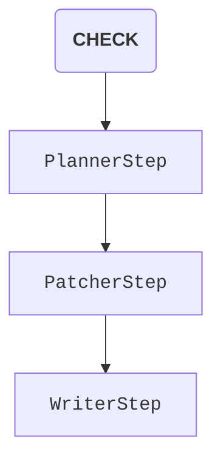
```mermaid
flowchart TD

CP(<b>CHECK</b>)
P[<tt>PlannerStep</tt>]
H[<tt>PatcherStep</tt>]
W[<tt>WriterStep</tt>]

CP --> P --> H --> W
```

Primarily useful for CI or audit workflows.

______________________________________________________________________

### STRIP (Summary)

**Purpose:** Remove an existing TopMark header

**Mutation:** ❌ none (dry-run safe)

**Steps:**

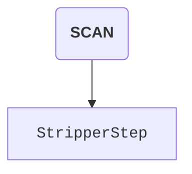
```mermaid
flowchart TD

SP(<b>SCAN</b>)
X[<tt>StripperStep</tt>]

SP --> X
```

**End states:**

- Header removed in rendered output
- No-op if header absent
- Skipped if unsupported or blocked

______________________________________________________________________

### STRIP_PATCH

**Purpose:** Show diff for header removal

**Mutation:** ❌ none

**Steps:**

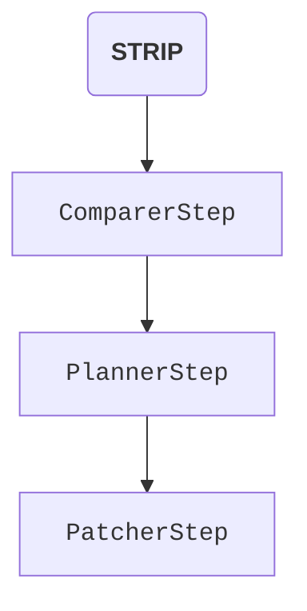
```mermaid
flowchart TD

XP(<b>STRIP</b>)
C[<tt>ComparerStep</tt>]
P[<tt>PlannerStep</tt>]
H[<tt>PatcherStep</tt>]

XP --> C --> P --> H
```

______________________________________________________________________

### STRIP_APPLY

**Purpose:** Remove headers in place

**Mutation:** ✅ writes enabled

**Steps:**

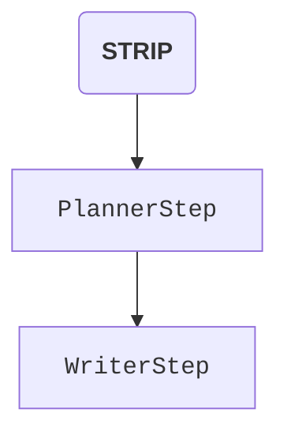
```mermaid
flowchart TD

XP(<b>STRIP</b>)
P[<tt>PlannerStep</tt>]
W[<tt>WriterStep</tt>]

XP --> P --> W
```

______________________________________________________________________

### STRIP_APPLY_PATCH

**Purpose:** Remove headers and emit patch

**Mutation:** ✅ writes enabled

**Steps:**

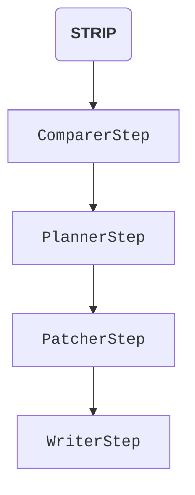
```mermaid
flowchart TD

XP(<b>STRIP</b>)
C[<tt>ComparerStep</tt>]
P[<tt>PlannerStep</tt>]
H[<tt>PatcherStep</tt>]
W[<tt>WriterStep</tt>]

XP --> C --> P --> H --> W
```

______________________________________________________________________

## Step Responsibilities

Each step implements the \[`Step`\][topmark.pipeline.protocols.Step] protocol and:

- Declares which **status axes** it may write
- May halt execution via `ctx.flow.halt`
- Emits structured hints for diagnostics

| Step                                                             | Responsibility                                                                                            |
| ---------------------------------------------------------------- | --------------------------------------------------------------------------------------------------------- |
| \[`ProberStep`\][topmark.pipeline.steps.prober.ProberStep]       | Run resolution probe and expose scored candidates, selection, and processor binding                       |
| \[`ResolverStep`\][topmark.pipeline.steps.resolver.ResolverStep] | Determine file type and header processor (see [`Resolution`](resolution.md))                              |
| \[`SnifferStep`\][topmark.pipeline.steps.sniffer.SnifferStep]    | Fast policy and newline checks                                                                            |
| \[`ReaderStep`\][topmark.pipeline.steps.reader.ReaderStep]       | Read file content safely                                                                                  |
| \[`ScannerStep`\][topmark.pipeline.steps.scanner.ScannerStep]    | Locate existing header bounds                                                                             |
| \[`BuilderStep`\][topmark.pipeline.steps.builder.BuilderStep]    | Build expected header field values and POSIX-serialized metadata paths for the selected processing target |
| \[`RendererStep`\][topmark.pipeline.steps.renderer.RendererStep] | Render header text                                                                                        |
| \[`ComparerStep`\][topmark.pipeline.steps.comparer.ComparerStep] | Compare existing vs rendered header                                                                       |
| \[`StripperStep`\][topmark.pipeline.steps.stripper.StripperStep] | Remove header content                                                                                     |
| \[`PlannerStep`\][topmark.pipeline.steps.planner.PlannerStep]    | Decide insert / replace / remove plan                                                                     |
| \[`PatcherStep`\][topmark.pipeline.steps.patcher.PatcherStep]    | Generate unified diff with human-facing display labels                                                    |
| \[`WriterStep`\][topmark.pipeline.steps.writer.WriterStep]       | Persist changes                                                                                           |

______________________________________________________________________

## Conditional and Policy-Driven End States

Some pipelines may terminate early due to **policy or safety constraints**:

Configuration validation happens before these pipeline steps run. Under effective strict config
checking, configuration warnings are treated as validation failures and may prevent pipeline
execution from starting.

- Binary files
- Mixed line endings
- BOM before shebang
- Missing read/write permissions
- Hard-linked processing targets
- Unsupported file types

In these cases:

- The pipeline halts cleanly
- No mutation occurs
- A terminal hint explains *why* the file was skipped or blocked

This guarantees:

- Safe dry-runs
- No partial writes
- Idempotent behavior across repeated runs

______________________________________________________________________

## Key Design Guarantees

- **Immutability:** Pipelines are `Final[tuple[Step, ...]]`
- **Determinism:** Same input → same outcome
- **Processing-path identity:** pipeline steps operate on selected processing paths, not raw
  invocation spellings
- **Filesystem-identity safety:** hard-linked selected processing paths are blocked before ordinary
  per-file step execution without choosing a preferred path
- **Dry-run safety:** No writes without `--apply`
- **Separation of concerns:** Steps mutate context, views classify outcomes
- **Runtime/configuration separation:** pipeline execution consumes resolved runtime configuration
  and runtime options rather than re-running TOML discovery during step execution

______________________________________________________________________

## See also

- [Architecture](./architecture.md) - TOML → FrozenConfig → runtime overview
- [Resolution](./resolution.md)
  - [Filesystem identity and processing paths](./resolution.md#filesystem-identity-and-processing-paths)
    \- filesystem-identity evaluation, symlink normalization, hard-link policy, and processing-path
    selection
- [Pipelines (Reference)](./pipelines-reference.md) - generated API-backed reference entry points
- [Terminology and Canonical Vocabulary](../terminology.md) - canonical definitions for pipeline,
  status, hint, runtime, and machine-readable terminology
- [Machine-readable output](../usage/machine-output.md) - how pipeline results are exposed in JSON
  and NDJSON outputs
- [Configuration discovery](../configuration/discovery.md) - source-local TOML options and
  precedence

This pipeline model is the backbone of TopMark's reliability and extensibility. New behavior is
introduced by adding steps or composing new pipelines, not by special-casing control flow.

______________________________________________________________________

## Per-axis lifecycle

TopMark tracks progress using a set of **status axes**. Each axis starts in `PENDING` and
transitions as steps complete or halt early.

These diagrams are intentionally coarse: they show *possible* terminal states, not every code path.

### Resolve axis

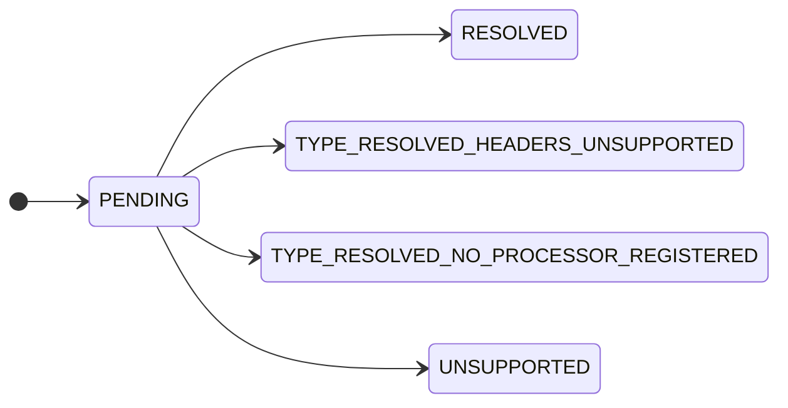
```mermaid
stateDiagram-v2
  direction LR
  [*] --> PENDING
  PENDING --> RESOLVED
  PENDING --> TYPE_RESOLVED_HEADERS_UNSUPPORTED
  PENDING --> TYPE_RESOLVED_NO_PROCESSOR_REGISTERED
  PENDING --> UNSUPPORTED
```

### FS axis

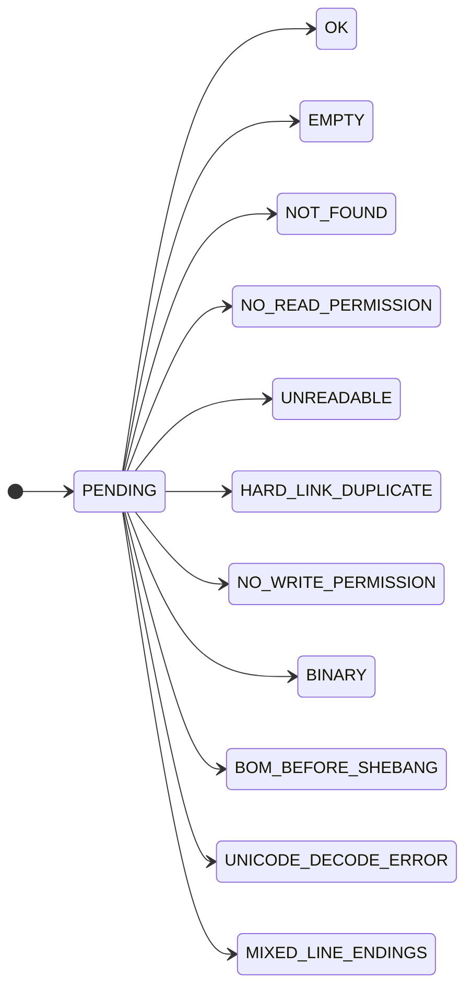
```mermaid
stateDiagram-v2
  direction LR
  [*] --> PENDING
  PENDING --> OK
  PENDING --> EMPTY
  PENDING --> NOT_FOUND
  PENDING --> NO_READ_PERMISSION
  PENDING --> UNREADABLE
  PENDING --> HARD_LINK_DUPLICATE
  PENDING --> NO_WRITE_PERMISSION
  PENDING --> BINARY
  PENDING --> BOM_BEFORE_SHEBANG
  PENDING --> UNICODE_DECODE_ERROR
  PENDING --> MIXED_LINE_ENDINGS
```

### Content axis

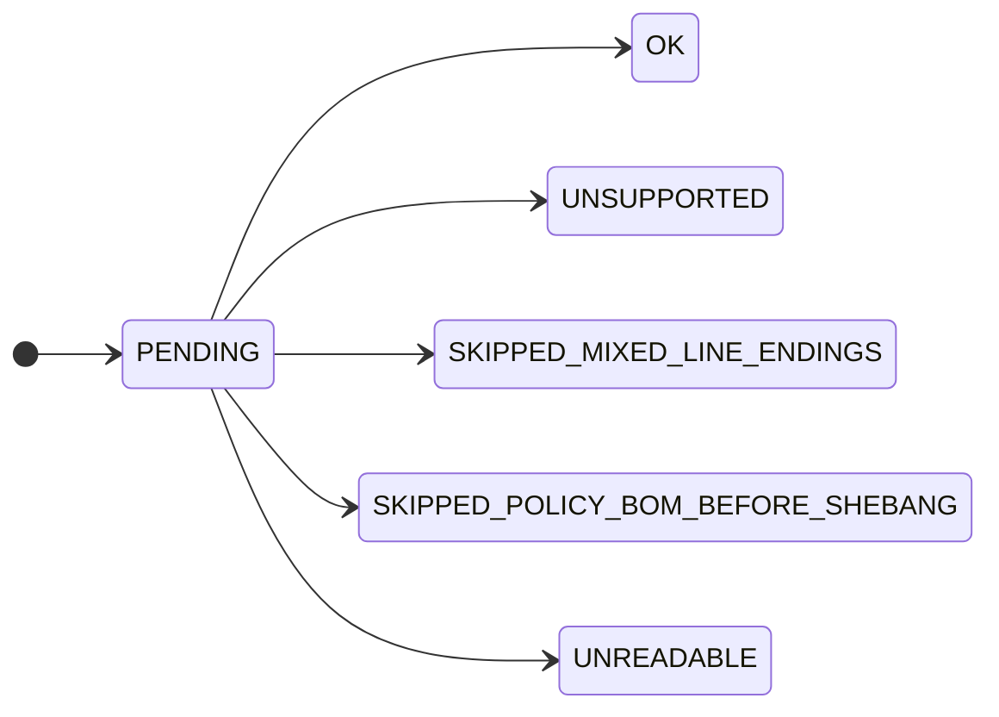
```mermaid
stateDiagram-v2
  direction LR
  [*] --> PENDING
  PENDING --> OK
  PENDING --> UNSUPPORTED
  PENDING --> SKIPPED_MIXED_LINE_ENDINGS
  PENDING --> SKIPPED_POLICY_BOM_BEFORE_SHEBANG
  PENDING --> UNREADABLE
```

### Header axis

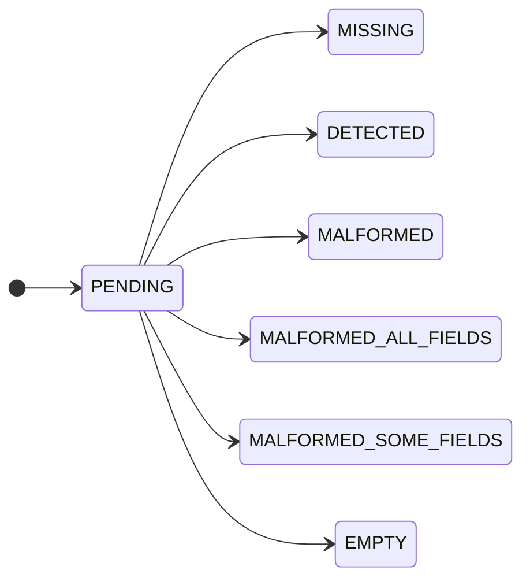
```mermaid
stateDiagram-v2
  direction LR
  [*] --> PENDING
  PENDING --> MISSING
  PENDING --> DETECTED
  PENDING --> MALFORMED
  PENDING --> MALFORMED_ALL_FIELDS
  PENDING --> MALFORMED_SOME_FIELDS
  PENDING --> EMPTY
```

### Generation axis

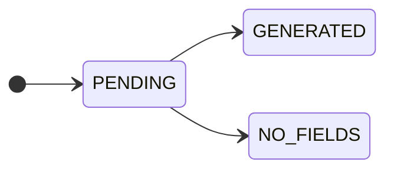
```mermaid
stateDiagram-v2
  direction LR
  [*] --> PENDING
  PENDING --> GENERATED
  PENDING --> NO_FIELDS
```

### Render axis

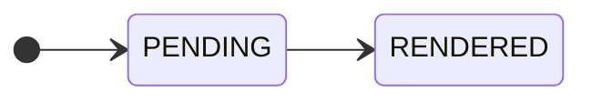
```mermaid
stateDiagram-v2
  direction LR
  [*] --> PENDING
  PENDING --> RENDERED
```

### Comparison axis

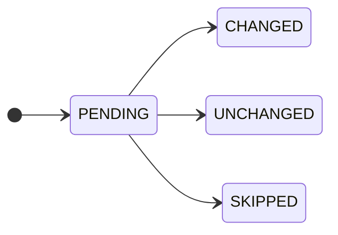
```mermaid
stateDiagram-v2
  direction LR
  [*] --> PENDING
  PENDING --> CHANGED
  PENDING --> UNCHANGED
  PENDING --> SKIPPED
```

### Strip axis

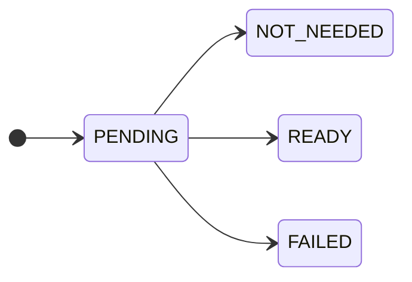
```mermaid
stateDiagram-v2
  direction LR
  [*] --> PENDING
  PENDING --> NOT_NEEDED
  PENDING --> READY
  PENDING --> FAILED
```

### Plan axis

```mermaid
stateDiagram-v2
  direction LR
  [*] --> PENDING
  PENDING --> PREVIEWED
  PENDING --> REPLACED
  PENDING --> INSERTED
  PENDING --> REMOVED
  PENDING --> SKIPPED
  PENDING --> FAILED
```

### Patch axis

```mermaid
stateDiagram-v2
  direction LR
  [*] --> PENDING
  PENDING --> GENERATED
  PENDING --> SKIPPED
  PENDING --> FAILED
```

### Write axis

```mermaid
stateDiagram-v2
  direction LR
  [*] --> PENDING
  PENDING --> WRITTEN
  PENDING --> SKIPPED
  PENDING --> FAILED
```

______________________________________________________________________

## CLI-focused flowcharts

These diagrams describe the **user-visible** execution paths behind
[`topmark check`](../usage/commands/check.md) and [`topmark strip`](../usage/commands/strip.md),
including the `--patch` and `--apply` switches.

### [`topmark check`](../usage/commands/check.md)

```mermaid
flowchart TD
  A[User runs: topmark check]
  B[SCAN: resolve + sniff + read + scan]
  C[CHECK_RENDER: build + render]
  D[COMPARE]
  E[Report: unchanged]
  F[Plan insert/replace]
  G[Report: would change]
  H[Generate patch]
  I[Write file]
  J[Report: patch shown]
  K[Report: written]
  L[Blocked by policy/fs/content]
  M[Report: skipped/unsupported/error]

  A --> B
  B --> C
  C --> D
  D -->|unchanged| E
  D -->|would change| F
  F -->|no --patch, no --apply| G
  F -->|--patch| H
  F -->|--apply| I
  H --> J
  I --> K
  B --> L --> M
```

### [`topmark strip`](../usage/commands/strip.md)

```mermaid
flowchart TD
  A[User runs: topmark strip]
  B[SCAN: resolve + sniff + read + scan]
  C[STRIP: compute removal]
  D[COMPARE]
  E[Report: no-op]
  F[Plan removal]
  G[Report: would remove]
  H[Generate patch]
  I[Write file]
  J[Report: patch shown]
  K[Report: written]
  L[Blocked by policy/fs/content]
  M[Report: skipped/unsupported/error]

  A --> B
  B --> C
  C --> D
  D -->|nothing to remove| E
  D -->|would remove| F
  F -->|no --patch, no --apply| G
  F -->|--patch| H
  F -->|--apply| I
  H --> J
  I --> K
  B --> L --> M
```

Filtered or missing explicit inputs are not produced by
\[`ProberStep`\][topmark.pipeline.steps.prober.ProberStep] itself. They are represented by synthetic
contexts created by probe orchestration before final presentation, API, and machine-readable output
packaging.
