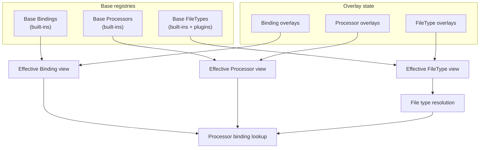
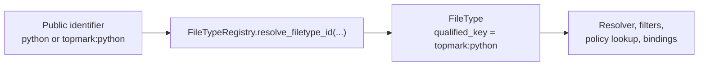
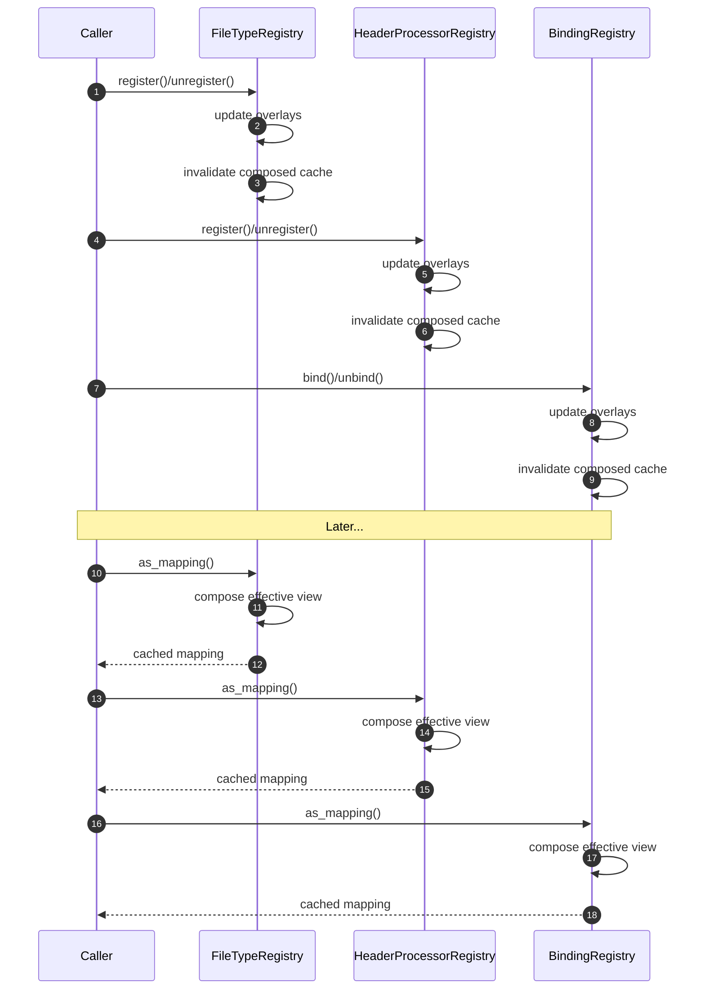

<!--
topmark:header:start

  project      : TopMark
  file         : registry-model.md
  file_relpath : docs/dev/registry-model.md
  license      : MIT
  copyright    : (c) 2025 Olivier Biot

topmark:header:end
-->

# Registry Model

TopMark uses a layered registry architecture to manage:

- file type identities
- header processor identities
- bindings between file types and processors
- runtime overlays and extensions
- resolver and probe integration

The registry model is explicit and deterministic. Identity registration and processor binding are
separate operations.

This page owns the detailed registry model. The broader system architecture is documented in
[Architecture overview](architecture.md).

______________________________________________________________________

## Runtime model overview

The runtime registry model is primarily composed of:

- \[`FileType`\][topmark.filetypes.model.FileType]
- \[`HeaderProcessor`\][topmark.processors.base.HeaderProcessor]
- binding relationships managed through
  \[`BindingRegistry`\][topmark.registry.bindings.BindingRegistry]

These runtime objects participate in:

- file type resolution
- processor dispatch
- policy lookup
- pipeline execution
- CLI introspection
- machine-readable output rendering

The usage documentation intentionally focuses on runtime behavior and stable CLI contracts rather
than internal implementation objects.

Implementation details and advanced overlay mutation behavior are documented here for maintainers,
plugin authors, and advanced integrators.

______________________________________________________________________

## Design goals

The registry model exists to make TopMark extensible without making runtime behavior implicit or
order-dependent.

Earlier process-global mutable registries made tests order-dependent and blurred the distinction
between introspection and mutation. The current model keeps base registry data stable and confines
mutation to explicit overlays.

The main goals are:

1. deterministic behavior across CLI, API, tests, and documentation generation;
1. safe extensibility for plugins and tests;
1. clear separation between introspection and mutation;
1. efficient composition of effective runtime views;
1. test isolation for registry overlays;
1. a single effective registry view for resolver, pipeline, API, and CLI behavior.

______________________________________________________________________

## Base registries and overlays

TopMark composes effective registries from immutable base registry data plus mutable overlay state.

Base registries contain:

- built-in file types;
- discovered file type plugins;
- built-in processor definitions;
- built-in file-type-to-processor bindings.

Overlay state contains process-local additions and removals requested by tests, plugins, or advanced
integrations.

The effective runtime view is:

```text
base registry + overlay additions - overlay removals
```

Base registries are not mutated by overlay operations.

This allows TopMark to keep built-ins stable while still supporting runtime extension and isolated
tests.



______________________________________________________________________

## Registry layers

TopMark separates identity registries from relationship registries.

### FileTypeRegistry

\[`FileTypeRegistry`\][topmark.registry.filetypes.FileTypeRegistry] manages file type identities.

Each file type has:

- namespace
- local key
- qualified key
- extensions
- matching metadata

Examples of local identifiers:

```text
python
markdown
```

Examples of canonical qualified identifiers:

```text
topmark:python
topmark:markdown
```

Internally, TopMark normalizes identifiers to canonical qualified keys.

Local identifiers are accepted only when unambiguous.

### HeaderProcessorRegistry

\[`HeaderProcessorRegistry`\][topmark.registry.processors.HeaderProcessorRegistry] manages header
processor identities.

Processors are independent from file types. This allows:

- multiple file types to share a processor;
- processor bindings to change without redefining file types;
- runtime overlays and plugin integration.

### BindingRegistry

\[`BindingRegistry`\][topmark.registry.bindings.BindingRegistry] manages relationships between file
types and processors.

Bindings determine:

- which processor is selected for a file type;
- whether a recognized file type is supported;
- which processor participates in header operations.

This separation prevents implicit side effects between identity registration and binding.

______________________________________________________________________

## Registry facade

\[`Registry`\][topmark.registry.registry.Registry] provides the stable read-only facade over the
composed runtime registries.

The facade exposes immutable effective views.

The stable public-facing runtime facade is:

- \[`Registry`\][topmark.registry.registry.Registry]

Most integrations should prefer the facade rather than interacting directly with the advanced
registries.

Examples:

```python
from topmark.registry.registry import Registry

for ft in Registry.filetypes().values():
    print(ft.qualified_key)
```

```python
from topmark.registry.registry import Registry

for binding in Registry.bindings():
    print(binding.file_type_key, binding.processor_key)
```

______________________________________________________________________

## Public facade vs advanced registries

The stable public-facing runtime registry entry point is:

- \[`Registry`\][topmark.registry.registry.Registry]

It exposes read-only effective views and is suitable for introspection.

The advanced registries are:

- \[`FileTypeRegistry`\][topmark.registry.filetypes.FileTypeRegistry]
- \[`HeaderProcessorRegistry`\][topmark.registry.processors.HeaderProcessorRegistry]
- \[`BindingRegistry`\][topmark.registry.bindings.BindingRegistry]

These provide overlay mutation helpers such as registration, unregistration, binding, and unbinding.
They are intended for:

- tests;
- plugins;
- advanced integrations.

Overlay mutation helpers affect overlay state only. They do not mutate built-in or plugin-discovered
base registry entries.

______________________________________________________________________

## Qualified vs local identifiers

TopMark accepts file type identifiers in either:

- local form (`python`);
- qualified form (`topmark:python`).

Internally, identifiers normalize to canonical qualified keys.

Local identifiers are accepted only when unambiguous.

If multiple registered file types share the same local identifier, callers must use the qualified
form.

Examples:

```text
topmark:python
acme:python
```

In this situation:

```text
python
```

is ambiguous.

Use:

```text
topmark:python
```

instead.

Advanced registry-facing APIs resolve identifiers using
\[`FileTypeRegistry.resolve_filetype_id(...)`\][topmark.registry.filetypes.FileTypeRegistry.resolve_filetype_id],
which returns the matching \[`FileType`\][topmark.filetypes.model.FileType] instance from the
effective composed registry.



______________________________________________________________________

## Recognized vs supported file types

A file type is **recognized** if its file type identifier exists in
\[`FileTypeRegistry`\][topmark.registry.filetypes.FileTypeRegistry].

A file type is supported if it is **recognized** and has an effective binding in
\[`BindingRegistry`\][topmark.registry.bindings.BindingRegistry] to a registered processor
definition in \[`HeaderProcessorRegistry`\][topmark.registry.processors.HeaderProcessorRegistry].

A file may be recognized but still unbound. In that case:

- it participates in discovery and filtering;
- it may appear in results depending on the selected report scope;
- no header insertion or removal is attempted.

______________________________________________________________________

## Resolver integration

The resolver and probe system operate on canonical qualified identifiers.

This affects:

- include/exclude file-type filters;
- policy lookup;
- runtime bindings;
- probe diagnostics;
- CLI filtering;
- API overlays.

Resolver and probe APIs:

- [`topmark probe`](../usage/commands/probe.md)
- \[`probe_resolution_for_path()`\][topmark.resolution.filetypes.probe_resolution_for_path]
- \[`topmark.api.probe()`\][topmark.api.probe]

______________________________________________________________________

## Plugin integration

File type plugins are discovered through the \[`topmark.filetypes`\][topmark.filetypes] entry point
group.

Plugin-defined file types participate in the same composed registry and identifier semantics as
built-in file types.

Plugin authors should:

- use a stable namespace such as `acme` or `my_plugin`;
- choose clear local keys such as `django_html` or `my_lang`;
- document and use qualified identifiers such as `acme:django_html` in shared examples;
- avoid relying on local identifiers remaining unambiguous as ecosystems grow.

Header processor plugins are currently advanced runtime-overlay integrations. They should bind
processor definitions to canonical qualified file type identifiers.

For a plugin-focused guide, see [Plugins and extensibility](plugins.md).

______________________________________________________________________

## Runtime overlays

Advanced integrations may register runtime overlays. Overlay mutations invalidate composed
effective-view caches as described in [Caching and invalidation](#caching-and-invalidation).

Examples include:

- plugins;
- tests;
- temporary runtime bindings;
- integration-specific file types.

Overlay mutations affect only overlay state layered on top of immutable base registries.

Overlay operations may:

- register or unregister file types;
- register or unregister processors;
- bind or unbind processors to file types.

Overlay mutations are:

- process-local;
- overlay-only;
- thread-safe;
- cache-invalidating.

They do not mutate built-in or plugin-discovered base registry entries.

Overlay state exists specifically to support:

- isolated tests;
- temporary runtime extensions;
- advanced integration scenarios;
- plugin composition without mutating built-ins.

After overlay mutation, the next effective registry read recomposes the effective runtime view from:

```text
base registry + overlay additions - overlay removals
```

Most integrations should prefer the stable \[`Registry`\][topmark.registry.registry.Registry] facade
and avoid direct overlay mutation unless runtime extension behavior is explicitly required.

______________________________________________________________________

## Caching and invalidation

Base registries are cached because construction and plugin discovery should happen once per process.

Composed effective views are also cached for fast repeated access.

Any overlay mutation invalidates the composed-view cache. The next call to an effective view, such
as `as_mapping()` or the \[`Registry`\][topmark.registry.registry.Registry] facade, recomposes the
view from base registry data and overlay state.

Practical consequences:

- overlay mutations are cheap;
- registry reads remain fast;
- tests that mutate overlays must clean them up;
- callers do not need to manage composed cache invalidation manually.



______________________________________________________________________

## Runtime extension example

```python
from topmark.registry.bindings import BindingRegistry
from topmark.registry.filetypes import FileTypeRegistry
from topmark.registry.processors import HeaderProcessorRegistry

# Register file type identity.
FileTypeRegistry.register(ft)

# Register processor identity.
proc_def = HeaderProcessorRegistry.register(
    processor_class=MyProcessor,
)

# Bind file type to processor.
BindingRegistry.bind(
    file_type_key=ft.qualified_key,
    processor_key=proc_def.qualified_key,
)
```

Cleanup should reverse the same steps explicitly:

```python
BindingRegistry.unbind(ft.qualified_key)
HeaderProcessorRegistry.unregister(proc_def.qualified_key)
FileTypeRegistry.unregister(ft.qualified_key)
```

When registering processors against file types, prefer qualified file type identifiers such as
`topmark:python` or `my_plugin:django_html` once multiple namespaces are in play. Local identifiers
remain supported when unambiguous, but may become ambiguous as extensions are added.

For long-term or redistributable extensions, prefer publishing a plugin using the
\[`topmark.filetypes`\][topmark.filetypes] entry point group.

______________________________________________________________________

## Registry CLI commands

TopMark provides registry inspection commands.

Examples:

```bash
topmark registry filetypes
```

```bash
topmark registry processors
```

```bash
topmark registry bindings
```

These commands expose the effective composed runtime view.

Use:

```bash
topmark registry --help
```

for available subcommands and output options.

______________________________________________________________________

## Why not per-run registries?

Registries are intentionally process-global rather than passed through every runtime layer as
per-run objects.

Reasons include:

- registry contents affect discovery, resolution, bindings, and pipeline execution;
- threading registry objects through every API would significantly complicate the runtime model;
- most users do not need per-run registry customization;
- overlay mutation already provides explicit runtime extension when required.

Configuration controls which file types participate in a run. Registries control which file types,
processors, and bindings exist in the effective runtime environment.

______________________________________________________________________

## Non-goals

The registry model is not designed to provide:

- transactional registry mutation in production code;
- fuzzy matching for file type identifiers;
- implicit namespace fallback;
- silent mutation of built-in or plugin-provided base entries;
- per-run registry objects passed through every runtime layer.

Configuration controls which file types are selected for a run. Registries control what file types,
processors, and bindings exist in the effective runtime environment.

______________________________________________________________________

## Stability model

The stable public API surface is defined by:

- \[`topmark.api`\][topmark.api]
- the CLI contract
- documented DTOs and result views

Registry internals are documented for maintainers and advanced integrators, but registry overlay
mutation behavior remains more flexible than the stable `topmark.api` execution API.

Advanced registry internals are intentionally more flexible.

Most integrations should prefer:

- \[`topmark.api`\][topmark.api]
- \[`Registry`\][topmark.registry.registry.Registry]
- probe APIs

rather than mutating advanced registries directly.

______________________________________________________________________

## Related docs

- [Architecture overview](architecture.md)
- [Public API](../api/public.md)
- [API internals](../api/internals.md)
- Registry API internals: \[`topmark.registry`\][topmark.registry]
- [Plugins and extensibility](plugins.md)
- [API stability](api-stability.md)
- [CLI overview](../usage/cli.md)
- [Registry CLI commands](../usage/commands/registry.md)
- [Configuration](../usage/configuration.md)
- [Filtering](../usage/filtering.md)
- [Policies](../usage/policies.md)
