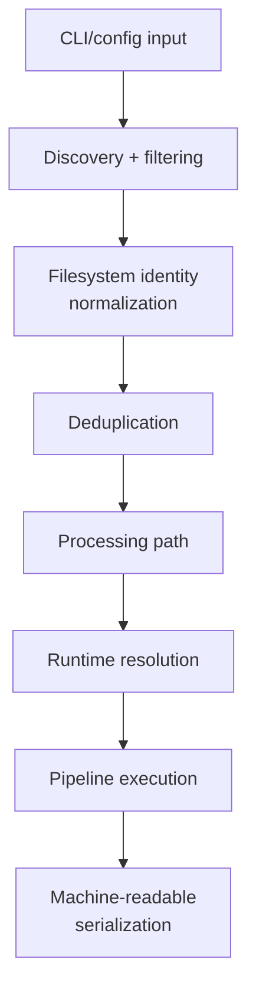

<!--
topmark:header:start

  project      : TopMark
  file         : resolution.md
  file_relpath : docs/dev/resolution.md
  license      : MIT
  copyright    : (c) 2025 Olivier Biot

topmark:header:end
-->

# File type resolution and ambiguity policy

This page documents how TopMark resolves a concrete filesystem path to the most specific matching
\[`FileType`\][topmark.filetypes.model.FileType], and then to the bound
\[`HeaderProcessor`\][topmark.processors.base.HeaderProcessor] registered for that file type.

Resolver behavior is deterministic and operates on canonical qualified file type identities such as
`topmark:python`.



It complements the registry architecture described in [`registry-model.md`](registry-model.md):

- registries define **what exists**
- the resolver defines **what wins for a concrete path**

This resolver operates within the broader TOML →
\[`FrozenConfig`\][topmark.config.model.FrozenConfig] → runtime architecture (see
[`architecture.md`](architecture.md)). It consumes the effective composed runtime registry state and
does not perform configuration discovery, layered configuration provenance export, or staged
config-loading validation strictness resolution itself.

In particular, source-local TOML options such as `[config].root` and `[config].strict` are resolved
before runtime file-type resolution and probing begin. They influence discovery and staged
config-loading validation behavior, but are not part of the resolver's matching or tie-break logic.



This distinction is also visible in
[`topmark config dump --show-layers`](../usage/commands/config/dump.md): layered provenance exports
are produced earlier from resolved TOML sources and the flattened compatibility view, while
file-type resolution happens later against the already-validated effective runtime configuration.

______________________________________________________________________

## Overview

TopMark has two different resolution modes:

- **Identifier-based lookup** resolves file types or processors from explicit local or qualified
  identifiers through the registries.
- **Path-based resolution** resolves a real path by evaluating extension, filename, pattern, and
  optional content-based signals.

Registry-facing APIs normalize identifiers to canonical qualified keys before resolver and binding
operations.

Before path-based resolution runs, TopMark performs file discovery and filtering. Paths excluded at
that stage do not participate in candidate generation or scoring.

Before runtime file-type probing begins, discovery also establishes a canonical filesystem identity
and processing path for each selected file.

Multiple path spellings that resolve to the same processing target (for example a symlink and its
target) are collapsed before pipeline execution. Runtime resolution therefore operates on processing
paths rather than original CLI, configuration, glob, or symlink spellings.

File-type filters accept both local identifiers such as `python` and canonical qualified identifiers
such as `topmark:python`.

Resolver filtering operates on canonical qualified file type identities.

Path-based resolution is implemented in
\[`topmark.resolution.filetypes`\][topmark.resolution.filetypes] and consumed by
\[`ResolverStep`\][topmark.pipeline.steps.resolver.ResolverStep].

The main public entry points are:

- \[`probe_resolution_for_path()`\][topmark.resolution.filetypes.probe_resolution_for_path]

These entry points participate only in **path-based runtime resolution and probing**. They do not
surface or consume layered config provenance payloads such as the human-facing `[[layers]]` export
or the machine-readable `config_provenance` payload used by `topmark config dump --show-layers`.

They operate after staged config-loading validation has completed and the effective runtime
configuration is finalized.



At this layer, path-based resolution consumes the already-finalized runtime configuration and
effective composed runtime registry state.

Public API callers provide mapping-based inputs; internal typed runtime override objects are
introduced earlier by CLI/API orchestration and are not part of the resolver contract.

See also:

- [`Architecture`](architecture.md)
- [`Registry model`](registry-model.md)
- [`Pipelines (Concepts)`](pipelines.md)
- [`Pipelines (Reference)`](pipelines-reference.md)
- [`Configuration discovery`](../configuration/discovery.md)
- [`Configuration index`](../configuration/index.md)
- [`Configuration`](../usage/configuration.md)
- [`Filtering`](../usage/filtering.md)
- [`CLI overview`](../usage/cli.md)

______________________________________________________________________

## Resolution pipeline boundaries

TopMark intentionally separates:

1. discovery filtering
1. runtime configuration resolution
1. registry composition
1. runtime file-type probing
1. deterministic winner selection
1. pipeline execution

Each stage operates on the finalized outputs of the previous stage.

This layered architecture keeps runtime resolution deterministic while preserving observability,
stable machine-readable diagnostics, and explicit configuration/runtime boundaries.

______________________________________________________________________

## Filesystem identity and processing paths

Path-based runtime resolution is not the first stage that operates on a user path.

Before a path reaches file-type probing, TopMark performs:

1. discovery
1. filtering
1. filesystem-identity normalization
1. deduplication
1. processing-path selection

The resulting processing path is then supplied to runtime probing and pipeline execution.



Machine-readable output serializes the selected processing path; it does not attempt to preserve the
original invocation spelling.

Filesystem identity is currently defined by the resolved processing target path.

Examples such as:

```text
real/file.py
./real/file.py
link-to-file.py
```

may therefore collapse to a single processing path before runtime resolution begins.

Hard-link detection and device/inode-based identity are outside the current compatibility contract.

______________________________________________________________________

## Probe-based resolution (1.0 contract)

TopMark 1.0 exposes a probe-first resolution model via
\[`probe_resolution_for_path()`\][topmark.resolution.filetypes.probe_resolution_for_path].

Probe-based resolution operates only after discovery filtering, filesystem- identity normalization,
processing-path selection, and configuration normalization have completed.

This function returns a \[`ResolutionProbeResult`\][topmark.resolution.probe.ResolutionProbeResult]
containing:

- selected file type and processor (if any)
- probe status and reason
- all scored candidate file types
- match signals used during resolution
- filtered explicit inputs that did not reach file-type probing

The probe result is the canonical source of truth for runtime resolution decisions once a processing
path reaches file-type probing. Explicit inputs may be filtered earlier during discovery; those
cases are represented as synthetic probe results with `status="filtered"` and one of:

- `reason="excluded_by_path_filter"`
- `reason="excluded_by_file_type_filter"`

This includes canonicalized file-type filtering using normalized qualified identifiers.

- `reason="excluded_by_discovery_filter"` (fallback when the exact category is not identified)
- \[`ResolverStep`\][topmark.pipeline.steps.resolver.ResolverStep] consumes `ctx.resolution_probe`
  and maps it to pipeline state
- \[`ProberStep`\][topmark.pipeline.steps.prober.ProberStep] exposes the same data for
  [`topmark probe`](../usage/commands/probe.md)

This unifies:

- human output (TEXT / Markdown)
- machine-readable output (JSON / NDJSON)
- pipeline runtime-resolution behavior

Callers should use
\[`probe_resolution_for_path()`\][topmark.resolution.filetypes.probe_resolution_for_path] when they
need path-based resolution details.

For stable integrations, prefer \[`topmark.api.probe()`\][topmark.api.probe], which returns
normalized public DTOs.

\[`probe_resolution_for_path()`\][topmark.resolution.filetypes.probe_resolution_for_path] is an
advanced helper that exposes internal runtime probe structures and is not part of the
\[`topmark.api`\][topmark.api] compatibility contract.

Note that \[`probe_resolution_for_path()`\][topmark.resolution.filetypes.probe_resolution_for_path]
only applies to paths that passed discovery filtering. The
[`topmark probe`](../usage/commands/probe.md) command augments these results with discovery-level
explanations for explicitly requested paths that were filtered before probing.

______________________________________________________________________

## Candidate generation

Candidate generation is performed by
\[`get_file_type_candidates_for_path()`\][topmark.resolution.filetypes.get_file_type_candidates_for_path].

For each effective \[`FileType`\][topmark.filetypes.model.FileType], the resolver evaluates
name-based signals and, when allowed, optional content-based signals.

Candidate generation operates against the effective composed runtime registry.

### Name-based signals

The resolver computes three name-based match signals:

- **extension**: the basename ends with one of the file type's configured extensions
- **filename**: the basename or normalized POSIX path tail matches one of the file type's configured
  filename rules
- **pattern**: the basename fully matches one of the file type's configured regular-expression
  patterns

Filename rules are declarative registry matching rules rather than filesystem paths. Exact-basename
rules match against `path.name`; relative tail-subpath rules match against `path.as_posix()`.

Tail-subpath rules are stored and emitted using canonical POSIX-style `/` separators.
Backslash-containing definitions are normalized during file-type construction before candidate
generation and scoring occur.

These signals are represented by \[`MatchSignals`\][topmark.resolution.filetypes.MatchSignals].

### Content gating

Content probing is controlled by the file type's
\[`ContentGate`\][topmark.filetypes.model.ContentGate]. This prevents unrelated files from being
probed unnecessarily and allows specialized overlay-style file types to refine generic matches.

Examples:

- `ContentGate.NEVER` disables content probing entirely
- `ContentGate.IF_EXTENSION` only allows probing when an extension matched
- `ContentGate.IF_FILENAME` only allows probing when a filename or tail matched
- `ContentGate.IF_PATTERN` only allows probing when a pattern matched
- `ContentGate.IF_ANY_NAME_RULE` allows probing when any name-based rule matched
- `ContentGate.IF_NONE` allows probing only when the file type declares no name-based rules
- `ContentGate.ALWAYS` allows content probing unconditionally

### Candidate inclusion

A file type becomes a candidate when its evaluated signals satisfy the runtime resolver's inclusion
rules.

This means that:

- a candidate may be included purely from name-based signals
- a candidate may be included only after a successful content probe
- a candidate may be excluded even when some name-based signals matched if the configured content
  gate requires a positive content hit

Candidate generation may therefore yield **multiple** file types for the same path. This is
intentional and is handled by the deterministic selection policy described below.

______________________________________________________________________

## Scoring model

Each included candidate is assigned a precedence score by `_score_file_type_candidate()`.

Higher scores are better.

The current precedence model is:

1. explicit filename or filename-tail match
1. content-confirmed match
1. pattern match
1. extension match

A small bonus is applied to file types that are not marked `skip_processing=True`, which gives
header-capable types a stable advantage on otherwise equal matches.

More specifically:

- exact-basename and tail-subpath filename-rule matches receive the highest scores and become more
  specific as the matched tail becomes longer
- content-confirmed matches outrank generic pattern and extension matches
- pattern matches outrank plain extension matches
- extension matches remain valid fallbacks for generic formats

The scoring model is intentionally biased toward the **most specific** match, while still keeping
generic file types useful as fallbacks.

______________________________________________________________________

## Deterministic selection

Final selection is handled by `_select_best_file_type_candidate()`.

TopMark does **not** treat multiple candidates as an error. Instead, it applies a deterministic
ordering key defined by
\[`candidate_order_key()`\][topmark.resolution.filetypes.candidate_order_key].

Candidates are ordered by:

1. score (**descending**)
1. namespace (**ascending**)
1. local key (**ascending**)

The winning file type is therefore stable for a given:

- effective composed runtime registry state
- path and filename
- file content
- configuration and filtering state

In practice, this means:

- the highest-scoring candidate wins
- if multiple candidates have the same score, namespace is used as the first stable tie-breaker
- if score and namespace are equal, local key is used as the final stable tie-breaker

This policy guarantees that the same path, content, and effective registry state always produce the
same winning \[`FileType`\][topmark.filetypes.model.FileType].

TopMark uses a deterministic winner-selection policy rather than an ambiguity-error policy.

______________________________________________________________________

## Ambiguity policy

Resolution may produce multiple matching file type candidates. This is **not** considered a registry
error.

This runtime resolution ambiguity policy is distinct from identifier ambiguity handling.

Identifier ambiguity occurs when a local identifier such as `python` resolves to multiple file types
in the effective registry. In those situations, callers must use canonical qualified identifiers
such as `topmark:python`.

Overlap between file types is allowed because it enables useful patterns such as:

- a generic built-in file type plus a more specific plugin-defined variant
- a content-refined overlay type (for example, a JSON-like subtype over a generic JSON fallback)
- shared extensions with different filename or content rules

TopMark's ambiguity policy is therefore:

- multiple candidates are allowed during candidate generation
- the resolver must return **at most one** effective winner
- the winner is selected deterministically using the documented precedence and tie-break policy
- ambiguity does **not** raise an exception in the stable 1.x resolution model

This keeps resolution stable and practical while still allowing rich, overlapping file type
ecosystems.

______________________________________________________________________

## Logging and observability

When multiple candidates share the top score,
\[`probe_resolution_for_path()`\][topmark.resolution.filetypes.probe_resolution_for_path] records
the tie-break outcome in the returned
\[`ResolutionProbeResult`\][topmark.resolution.probe.ResolutionProbeResult].

The probe result surfaces the full candidate set, scores, match signals, selected candidate, and
reason (`selected_highest_score` or `selected_by_tie_break`). This makes resolution decisions fully
observable without relying on debug logging alone.

For explicitly requested paths that were filtered before probing, observability is provided through
synthetic probe results emitted by [`topmark probe`](../usage/commands/probe.md), rather than
through candidate-scoring data. The reported reason distinguishes whether the path was excluded by
path filters, file-type filters, or a generic discovery-filter fallback.

This makes ambiguous-but-resolvable situations observable during development and debugging without
turning them into hard failures.

Identifier normalization and file-type filter decisions are also observable through probe and
runtime-resolution diagnostics.

The log includes:

- the path being resolved
- the shared top score
- the qualified keys of the tied top candidates

This helps explain why a particular file type identity won when multiple strong candidates existed.

______________________________________________________________________

## Design rationale

TopMark intentionally resolves ambiguity in the resolver layer rather than in the registries.

This separation keeps responsibilities clear:

- \[`FileTypeRegistry`\][topmark.registry.filetypes.FileTypeRegistry] stores file type identities
  and canonical identifier resolution
- \[`HeaderProcessorRegistry`\][topmark.registry.processors.HeaderProcessorRegistry] stores
  processor identities
- \[`BindingRegistry`\][topmark.registry.bindings.BindingRegistry] stores effective
  file-type-to-processor relationships
- the runtime resolver decides which file type best matches a **concrete filesystem path**

The resolver deliberately does not define filesystem identity semantics.

Filesystem identity, symlink handling, deduplication, and processing-path selection occur earlier
during discovery and file-list resolution. The resolver consumes the resulting processing path and
focuses exclusively on file-type selection.

This design has several advantages:

- registries remain simple and declarative
- overlapping file types remain legal
- runtime resolution remains deterministic and testable
- plugin authors can define specialized file types without needing a separate override system in the
  registries

______________________________________________________________________

## Symlink policy

The runtime resolver operates on processing paths and therefore does not preserve original symlink
spellings.

Current behavior:

- file-symlink inputs are resolved to their processing target;
- symlink and target spellings are deduplicated before runtime processing;
- configuration-source identity is based on the resolved configuration-file target;
- machine-readable output serializes the resulting processing path; and
- generated filesystem-related header metadata describes the target TopMark reads and writes.

This policy contributes to idempotence and prevents duplicate processing of the same target file
through multiple spellings.

______________________________________________________________________

## Non-goals

The current resolver deliberately does **not** provide:

- user-configurable namespace priority
- a strict ambiguity error mode
- registry-time rejection of overlapping file type definitions
- fuzzy matching or implicit namespace fallback for identifier resolution
- pluggable custom precedence strategies

These may be introduced post-1.0 if there is a strong use case, but they are not part of the current
TopMark stable 1.x runtime-resolution contract.

______________________________________________________________________

## Possible future extensions

Possible future improvements include:

- a strict mode that surfaces certain ambiguities as explicit resolution errors
- user-configurable precedence overrides
- richer diagnostics or hints when deterministic tie-breaks are used
- plugin-defined precedence policies layered on top of the default scoring model
- richer probe diagnostics and scoring transparency in machine-readable output

For the stable 1.x line, the documented deterministic policy on this page is the source of truth.

______________________________________________________________________

## See also

- [`Architecture`](architecture.md) - registry design and system overview
- [`Registry model`](registry-model.md) - registry layers, bindings, overlays, and identifier
  semantics
- [`Terminology and Canonical Vocabulary`](../terminology.md) - canonical definitions for
  identifiers, applicability, ambiguity, and machine-readable terminology
- [`Plugins`](plugins.md) - how file types and processors are registered
- [`Machine-readable output`](../usage/machine-output.md) - how resolution results surface in JSON
  and NDJSON outputs
- [`Configuration`](../usage/configuration.md) - canonical file-type identifier semantics
- [`Filtering`](../usage/filtering.md) - discovery and file-type filter behavior
- [`CLI overview`](../usage/cli.md) - resolver-related CLI commands and filtering options
