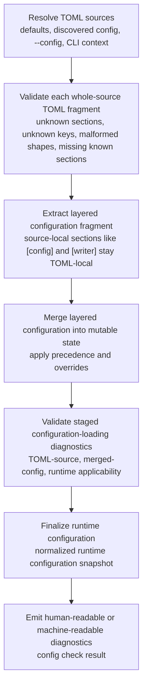

<!--
topmark:header:start

  project      : TopMark
  file         : check.md
  file_relpath : docs/usage/commands/config/check.md
  license      : MIT
  copyright    : (c) 2025 Olivier Biot

topmark:header:end
-->

# `topmark config check`

**Purpose:** Validate the effective runtime configuration and report configuration diagnostics.

The `config check` subcommand (part of [`topmark config`](../config.md)) validates the effective
runtime configuration and reports any configuration diagnostics.

Unlike [`check`](../check.md) / [`strip`](../strip.md), this command is **file-agnostic**: it does
not resolve or process files. It is intended for CI validation and debugging configuration
precedence issues.



______________________________________________________________________

## File type identifier semantics



See [file-type filtering](../../filtering.md#file-type-filtering) for the full identifier contract.

______________________________________________________________________

## Quick start

```bash
# Validate effective runtime configuration (default human output)
topmark config check

# Fail if warnings are present (in addition to errors)
topmark config check --strict

# CLI override wins over TOML strictness
# (even if topmark.toml contains `[config] strict = true`)
topmark config check --no-strict

# Machine-readable JSON (single document)
topmark config check --output-format json

# Machine-readable NDJSON (record stream)
topmark config check --output-format ndjson

# Suppress TEXT rendering and rely on the exit code
topmark config check --quiet

# Render document-oriented Markdown output
topmark config check --output-format markdown
```

______________________________________________________________________

## Behavior details

- **Validates effective runtime configuration**: loads defaults -> discovered config -> `--config`
  files -> CLI overrides, performs whole-source TOML validation per source before layered
  configuration merging and runtime applicability evaluation, then validates staged
  configuration-loading diagnostics and produces the final runtime configuration.

- **Reports TOML schema issues**: unknown sections/keys, malformed TOML structures, and missing
  known sections are surfaced as configuration diagnostics originating from the TOML layer.

- **File-agnostic**: positional PATHS are rejected as unexpected arguments. `-` is not
  content-on-STDIN for this command, and file-list STDIN modes such as `--files-from -` do not
  apply.

- **CI-friendly**: exits with `CONFIG_ERROR (78)` when validation fails.

- **Strict mode**: effective strictness is determined as:

  - CLI override (`--strict` / `--no-strict`)
  - resolved TOML value from `[config].strict` / `[tool.topmark.config].strict`
  - default non-strict mode

  Errors always fail; warnings fail only when strict config checking is enabled across staged
  configuration-loading validation.

TopMark resolves configuration from defaults, user config, the project chain, explicit `--config`
files, and CLI overrides before staged validation produces the effective runtime configuration. See
[Configuration discovery, precedence, and policy](../../../configuration/discovery.md) for the full
configuration-loading and validation contract.

Configuration and policy override values shown by this command are part of the stable public
configuration surface. Internal implementation helpers such as
\[`PolicyOverrides`\][topmark.config.overrides.PolicyOverrides] and
\[`ConfigOverrides`\][topmark.config.overrides.ConfigOverrides] are not part of the user-facing CLI
or Python API contract.

API overlays follow the same identifier normalization and runtime policy-resolution semantics
documented above for TOML configuration and CLI filtering.

______________________________________________________________________

## When to use

- In CI to ensure config changes do not introduce warnings/errors.
- When debugging configuration discovery/precedence (e.g. *why is this policy enabled?*).
- When integrating TopMark configuration into external tooling that needs a validated snapshot.

______________________________________________________________________

## Input applicability

`config check` validates configuration state, not source files. It therefore does not accept
file-processing inputs:

- positional PATH arguments are rejected as invalid CLI usage
- `-` is not a content-STDIN sentinel for this command
- `--stdin-filename` does not apply
- file-list STDIN modes (for example, `--files-from -`) do not apply

Use `--config PATH` to validate an explicit config file, or rely on normal config discovery to
validate the effective runtime configuration for the current working directory.

______________________________________________________________________

## Command-specific options

| Option                 | Description                                                         |
| ---------------------- | ------------------------------------------------------------------- |
| `--strict/--no-strict` | Override resolved TOML strict configuration checking for this run.  |
| `--output-format`      | Output format (`text`, `markdown`, `json`, `ndjson`).               |
| `-q`, `--quiet`        | Suppress TEXT rendering while preserving the command's exit status. |
| `--config`             | Merge an explicit TOML config file (can be repeated).               |
| `--no-config`          | Do not discover local project/user config.                          |
| `-v`, `--verbose`      | Increase human-readable diagnostic detail.                          |

> Run `topmark config check -h` for the full list of options and help text.

______________________________________________________________________

## Output behavior

Output formats:

- `text`: human-readable validation result (optionally verbose).
- `markdown`: Markdown report suitable for pasting into tickets or CI logs.
- `json` / `ndjson`: machine-readable envelopes/records aligned with TopMark's machine-readable
  format conventions.

### Default output (human)

- If there are no diagnostics: prints a short success message.
- If diagnostics exist: prints counts of errors/warnings/info. With `-v` and above, it prints each
  diagnostic line.
- With higher TEXT verbosity, it also prints the list of configuration files that were processed.
- With very high TEXT verbosity, it can print the merged configuration as TOML (wrapped with
  BEGIN/END markers).
- `--quiet` suppresses TEXT rendering while preserving the exit status (does not affect exit codes).
- File-processing diagnostics, summaries, diffs, and reports are not emitted by this command.

### Markdown output

`--output-format markdown` emits a report containing:

- overall status (`ok` / `failed`)
- whether effective strict configuration checking was enabled
- diagnostic counts
- (optionally) full diagnostic list and processed config files, depending on verbosity

This format is designed for CI logs and copy/paste into issues. It is document-oriented and ignores
TEXT-oriented verbosity and quiet controls.

### Typical validation flow



______________________________________________________________________

## Machine-readable output

Use `--output-format json` or `--output-format ndjson` to emit output suitable for tools.

The canonical schema, stable `kind` values, and shared conventions are documented here:

- [Machine-readable output](../../machine-output.md)
- [Machine-readable format conventions](../../../dev/machine-formats.md)



Machine-readable configuration snapshots emit normalized canonical qualified file type identities
after configuration normalization.



Notes:

- `config check` emits diagnostics for both TOML schema validation and configuration
  loading/validation, including missing-section INFO diagnostics from the TOML layer, but not
  pipeline processing diagnostics.
- Validation follows staged configuration-loading validation: per-source TOML validation first
  (TOML-source diagnostics), then layered configuration merging (merged-config diagnostics), then
  final configuration-loading validation including runtime applicability checks. The effective
  validity decision is evaluated across these staged configuration-loading validation logs
  collectively. Identifier normalization and runtime applicability evaluation participate in this
  staged validation flow.

Example (`[config].strict = true` resolved from TOML, with no CLI override):

```jsonc
{
  "meta": { /* MetaPayload */ },
  "config": { /* RuntimeConfigPayload */ },
  "config_diagnostics": { /* ConfigDiagnosticsPayload */ },
  "config_check": {
    "ok": false,
    "strict": true,
    "diagnostic_counts": { "info": 0, "warning": 1, "error": 0 },
    "config_files": ["topmark.toml"]
  }
}
```

### JSON schema

A single JSON document is emitted:

```jsonc
{
  "meta": { /* MetaPayload */ },
  "config": { /* RuntimeConfigPayload */ },
  "config_diagnostics": { /* ConfigDiagnosticsPayload */ },
  "config_check": {
    "ok": true,
    "strict": false,
    "diagnostic_counts": { "info": 0, "warning": 0, "error": 0 },
    "config_files": ["..."]
  }
}
```

### NDJSON schema

NDJSON is a stream where each line is a JSON object. Every record includes `kind` and `meta`.

Stream:

1. kind="config" (effective runtime configuration snapshot)
1. kind="config_diagnostics" (counts-only)
1. kind="config_check" (summary: ok/strict/counts/config_files)
1. zero or more kind="diagnostic" records (each with domain="config")

Example:

```jsonc
{"kind":"config","meta":{...},"config":{...}}
{"kind":"config_diagnostics","meta":{...},"config_diagnostics":{"diagnostic_counts":{"info":0,"warning":0,"error":0}}}
{"kind":"config_check","meta":{...},"config_check":{"ok":true,"strict":false,"diagnostic_counts":{...},"config_files":[...]}}
{"kind":"diagnostic","meta":{...},"diagnostic":{"domain":"config","level":"warning","message":"..."}}
```

______________________________________________________________________

## Exit codes

`topmark config check` exits with `SUCCESS (0)` when the effective runtime configuration is valid.
It exits with `CONFIG_ERROR (78)` when configuration validation fails.

This includes:

- configuration-loading failures that prevent validation from completing;
- validation runs that report configuration errors; and
- warning-only results when strict configuration checking is enabled.

Common `config check` exit codes:

| Scenario                                      | Exit code           |
| --------------------------------------------- | ------------------- |
| Valid effective runtime configuration         | `SUCCESS (0)`       |
| Validation completed with failing diagnostics | `CONFIG_ERROR (78)` |
| Invalid CLI usage                             | `USAGE_ERROR (64)`  |

Notes:

- Click parser-level usage errors (for example, unknown commands, unknown options, or invalid option
  values) may exit with code `2` before command logic runs.
- `CONFIG_ERROR (78)` is the normal validation-failure result for this command.
- Warning-only diagnostics exit with `SUCCESS (0)` unless strict configuration checking is enabled.
- Malformed TOML discovered by `config check` is reported as a configuration-validation failure and
  exits with `CONFIG_ERROR (78)`.
- TopMark semantic validation and configuration-loading failures use `CONFIG_ERROR (78)`.

Because `config check` is file-agnostic, invalid positional paths or file-processing input options
are reported as CLI usage errors rather than as file-processing diagnostics.

See [`Exit codes`](../../exit-codes.md) for the complete CLI-wide exit-code contract.

______________________________________________________________________

## Stable configuration semantics

`config check` reflects the same stable configuration contract used by:

- CLI processing commands
- API overlays
- runtime resolution and filtering
- machine-readable output
- runtime policy lookup

Configuration handling intentionally does not support:

- fuzzy matching for file type identifiers
- implicit namespace fallback
- automatic alias expansion
- silent ambiguity resolution

______________________________________________________________________

## Related commands

- [`topmark config dump`](./dump.md) - show the effective runtime configuration, including
  normalized canonical file type identities.
- [`topmark config defaults`](./defaults.md) - show the *built-in default TopMark TOML document*.
- [`topmark config init`](./init.md) - print the bundled example TopMark TOML resource.

______________________________________________________________________

## Related docs

- [Command overview](../../cli.md)
- [Configuration](../../configuration.md)
- [Filtering](../../filtering.md)
- [Policies](../../policies.md)
- [Configuration discovery, precedence, and policy](../../../configuration/discovery.md)
- [Configuration schema](../../../dev/configuration-schema.md)
- [Machine-readable output](../../machine-output.md)
- [Machine-readable format conventions](../../../dev/machine-formats.md)
- [Exit codes](../../exit-codes.md)
- [Terminology and Canonical Vocabulary](../../../terminology.md)

______________________________________________________________________

## Troubleshooting

- **Unexpected file type filter behavior**: prefer qualified identifiers such as `topmark:python`
  when local identifiers may be ambiguous.
- **Unexpected policy application**: inspect normalized identifiers using
  [`topmark config dump`](./dump.md).
- **Unexpected validation failures**: use `-vv` or machine-readable output to inspect staged
  validation diagnostics.
