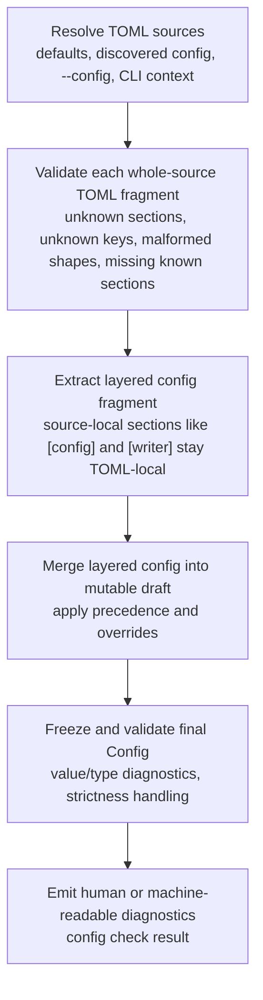

<!--
topmark:header:start

  project      : TopMark
  file         : check.md
  file_relpath : docs/usage/commands/config/check.md
  license      : MIT
  copyright    : (c) 2025 Olivier Biot

topmark:header:end
-->

# TopMark `config check` Command Guide

**Purpose:** Check the config for errors.

The `config check` subcommand (part of the TopMark [`config` Command Family](../config.md))
validates the **effective merged configuration** and reports any configuration diagnostics.

Unlike `check` / `strip`, this command is **file-agnostic**: it does not resolve or process files.
It is intended for CI validation and debugging configuration precedence issues.

- `text`: human-readable validation result (optionally verbose).
- `markdown`: Markdown report suitable for pasting into tickets or CI logs.
- `json` / `ndjson`: machine-readable envelopes/records aligned with TopMark’s machine format
  conventions.

______________________________________________________________________

## Quick start

```bash
# Validate merged config (default human output)
topmark config check

# Fail if warnings are present (in addition to errors)
topmark config check --strict

# CLI override wins over TOML strictness
# (even if topmark.toml contains `[config] strict_config_checking = true`)
topmark config check --no-strict

# Machine-readable JSON (single document)
topmark config check --output-format json

# Machine-readable NDJSON (record stream)
topmark config check --output-format ndjson
```

______________________________________________________________________

## Key properties

- **Validates merged config**: loads defaults → discovered config → `--config` files → CLI
  overrides, performs whole-source TOML schema validation per source, then freezes/validates the
  final configuration.

- **Reports TOML schema issues**: unknown sections/keys, malformed TOML structures, and missing
  known sections are surfaced as configuration diagnostics originating from the TOML layer.

- **File-agnostic**: positional PATHS are ignored (a note is printed). `-` (content-on-STDIN) is
  ignored.

- **CI-friendly**: exit code is non-zero when validation fails.

- **Strict mode**: effective strictness is determined as:

  - CLI override (`--strict` / `--no-strict`)
  - resolved TOML value from `[config].strict_config_checking` /
    `[tool.topmark.config].strict_config_checking`
  - default non-strict mode

  Errors always fail; warnings fail only when strict config checking is enabled across staged
  config-loading validation logs (TOML-source, merged-config, and runtime-applicability
  diagnostics).



______________________________________________________________________

## When to use

- In CI to ensure config changes do not introduce warnings/errors.
- When debugging configuration discovery/precedence (e.g. *why is this policy enabled?*).
- When integrating TopMark configuration into external tooling that needs a validated snapshot.

______________________________________________________________________

## Options (subset)

| Option                 | Description                                                 |
| ---------------------- | ----------------------------------------------------------- |
| `--strict/--no-strict` | Override resolved TOML strict config checking for this run. |
| `--output-format`      | Output format (`text`, `markdown`, `json`, `ndjson`).       |
| `--config`             | Merge an explicit TOML config file (can be repeated).       |
| `--no-config`          | Do not discover local project/user config.                  |

> Run `topmark config check -h` for the full list of options and help text.

______________________________________________________________________

## Exit codes

- **0**: configuration is valid (no failing diagnostics).
- **non-zero**: configuration validation failed:
  - errors are present, or
  - effective strict config checking is enabled and warnings are present.

______________________________________________________________________

## Output formats

### Default output (human)

- If there are no diagnostics: prints a short success message.
- If diagnostics exist: prints counts of errors/warnings/info. With higher verbosity, it prints each
  diagnostic line.
- With higher verbosity, it also prints the list of config files that were processed.
- With very high verbosity, it can print the merged config as TOML (wrapped with BEGIN/END markers).

### Markdown output

`--output-format markdown` emits a report containing:

- overall status (`ok` / `failed`)
- whether effective strict config checking was enabled
- diagnostic counts
- (optionally) full diagnostic list and processed config files, depending on verbosity

This format is designed for CI logs and copy/paste into issues.

### Typical validation flow



______________________________________________________________________

## Machine-readable output

Use `--output-format json` or `--output-format ndjson` to emit output suitable for tools.

The canonical schema, stable `kind` values, and shared conventions are documented here:

- [Machine output schema (JSON & NDJSON)](../../../dev/machine-output.md)
- [Machine formats](../../../dev/machine-formats.md)

Notes:

- `config check` emits diagnostics for both TOML schema validation and configuration
  loading/validation, including missing-section INFO diagnostics from the TOML layer, but not
  pipeline processing diagnostics.

- Validation follows staged config-loading validation: per-source TOML validation first (TOML-source
  diagnostics), then layered config merge (merged-config diagnostics), then final config validation
  including runtime-applicability checks. The effective validity decision is evaluated across these
  staged diagnostics collectively.

Example (`[config].strict_config_checking = true` resolved from TOML, with no CLI override):

```jsonc
{
  "meta": { /* MetaPayload */ },
  "config": { /* ConfigPayload */ },
  "config_diagnostics": { /* ConfigDiagnosticsPayload */ },
  "config_check": {
    "ok": false,
    "strict_config_checking": true,
    "diagnostic_counts": { "info": 0, "warning": 1, "error": 0 },
    "config_files": ["topmark.toml"]
  }
}
```

### JSON schema

A single JSON document is emitted:

```jsonc
{
  "meta": { /* MetaPayload */ },
  "config": { /* ConfigPayload */ },
  "config_diagnostics": { /* ConfigDiagnosticsPayload */ },
  "config_check": {
    "ok": true,
    "strict_config_checking": false,
    "diagnostic_counts": { "info": 0, "warning": 0, "error": 0 },
    "config_files": ["..."]
  }
}
```

### NDJSON schema

NDJSON is a stream where each line is a JSON object. Every record includes `kind` and `meta`.

Stream:

1. kind="config" (effective config snapshot)
1. kind="config_diagnostics" (counts-only)
1. kind="config_check" (summary: ok/strict/counts/config_files)
1. zero or more kind="diagnostic" records (each with domain="config")

Example:

```jsonc
{"kind":"config","meta":{...},"config":{...}}
{"kind":"config_diagnostics","meta":{...},"config_diagnostics":{"diagnostic_counts":{"info":0,"warning":0,"error":0}}}
{"kind":"config_check","meta":{...},"config_check":{"ok":true,"strict_config_checking":false,"diagnostic_counts":{...},"config_files":[...]}}
{"kind":"diagnostic","meta":{...},"diagnostic":{"domain":"config","level":"warning","message":"..."}}
```

______________________________________________________________________

## Related commands

- [`topmark config dump`](./dump.md) — show the *effective merged* configuration as TOML.
- [`topmark config defaults`](./defaults.md) — show the *built-in default TopMark TOML document*.
- [`topmark config init`](./init.md) — print the bundled example TopMark TOML resource.
