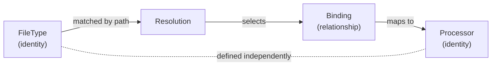

<!--
topmark:header:start

  project      : TopMark
  file         : registry.md
  file_relpath : docs/usage/commands/registry.md
  license      : MIT
  copyright    : (c) 2025 Olivier Biot

topmark:header:end
-->

# TopMark `registry` Command Family

TopMark exposes a `registry` command group to inspect the three core registry domains:

- [`topmark registry filetypes`](./registry/filetypes.md) — inspect **file type identities** and
  their matching rules and policies.
- [`topmark registry processors`](./registry/processors.md) — inspect **header processor
  identities** and their capabilities.
- [`topmark registry bindings`](./registry/bindings.md) — inspect **effective relationships**
  between file types and processors.

These commands reflect the internal split between identities (file types and processors) and
relationships (bindings), which together define how TopMark resolves and processes files.

## Conceptual model

This diagram illustrates how file types and processors are independent identities, while bindings
define the effective relationship used during resolution.
