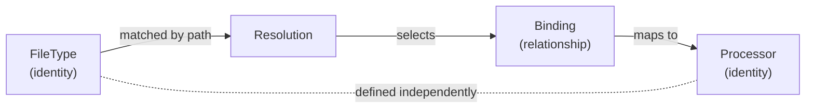

<!--
topmark:header:start

  project      : TopMark
  file         : registry.md
  file_relpath : docs/usage/commands/registry.md
  license      : MIT
  copyright    : (c) 2025 Olivier Biot

topmark:header:end
-->

# TopMark `registry` Command Family

TopMark exposes a `registry` command group to inspect the three core registry domains:

- [`topmark registry filetypes`](./registry/filetypes.md) — inspect **file type identities** and
  their matching rules and policies.
- [`topmark registry processors`](./registry/processors.md) — inspect **header processor
  identities** and their capabilities.
- [`topmark registry bindings`](./registry/bindings.md) — inspect **effective relationships**
  between file types and processors.

These commands reflect the internal split between identities (file types and processors) and
relationships (bindings), which together define how TopMark resolves and processes files.

______________________________________________________________________

## Command applicability

The `registry` command family is **informational and file-agnostic**. These commands inspect
TopMark's built-in registry state and do not process project files or configuration.

Across all `registry` subcommands:

- positional PATH arguments are rejected as invalid CLI usage
- `-` is not a content-STDIN sentinel
- `--stdin-filename` does not apply
- file-list STDIN modes (for example, `--files-from -`) do not apply
- `--quiet` is not supported; use output-format options for machine-readable output

Config discovery does not apply to registry commands.

## Exit codes

All `registry` subcommands are purely informational:

- They exit with `SUCCESS (0)` on successful execution.
- CLI usage errors (invalid or unsupported options) exit with `USAGE_ERROR (64)`.

Registry subcommands do not process project files and therefore do not use file-processing exit
codes such as `WOULD_CHANGE (2)`, `FILE_NOT_FOUND (66)`, or `IO_ERROR (74)`.

Invalid positional paths or file-processing input options are reported as CLI usage errors.

See [`Exit codes`](../exit-codes.md) for the complete CLI-wide exit-code contract.

## Conceptual model

This diagram illustrates how file types and processors are independent identities, while bindings
define the effective relationship used during resolution.
