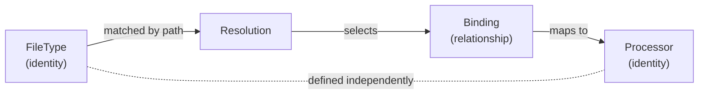

<!--
topmark:header:start

  project      : TopMark
  file         : registry.md
  file_relpath : docs/usage/commands/registry.md
  license      : MIT
  copyright    : (c) 2025 Olivier Biot

topmark:header:end
-->

# TopMark `registry` Command Family

TopMark exposes a `registry` command group to inspect the three core registry domains:

## Subcommands

| Command                                                 | Purpose                                                            |
| ------------------------------------------------------- | ------------------------------------------------------------------ |
| [`topmark registry filetypes`](registry/filetypes.md)   | Inspect file type identities, matching rules, and policies.        |
| [`topmark registry processors`](registry/processors.md) | Inspect registered header processor identities and capabilities.   |
| [`topmark registry bindings`](registry/bindings.md)     | Inspect effective relationships between file types and processors. |

These commands reflect the internal split between identities (file types and processors) and
relationships (bindings), which together define how TopMark resolves file types and selects
processors.

______________________________________________________________________

## Input applicability

The `registry` command family is **informational and file-agnostic**. These commands inspect
TopMark's effective composed registry state and do not process project files or perform
configuration discovery.

Across all `registry` subcommands:

- positional PATH arguments are rejected as invalid CLI usage
- `-` is not a content-STDIN sentinel
- `--stdin-filename` does not apply
- file-list STDIN modes (for example, `--files-from -`) do not apply
- `--quiet` is not supported; use output-format options for machine-readable output

Config discovery does not apply to registry commands.

Runtime overlays and plugin-discovered entries are still reflected in the effective registry view
exposed by these commands.

______________________________________________________________________

## Identity semantics

Registry commands expose canonical qualified identities.

Examples:

```text
topmark:python
topmark:markdown
```

TopMark may still accept local identifiers such as:

```text
python
markdown
```

in public CLI filters and configuration when unambiguous.

Registry-oriented machine-readable output and effective runtime views use canonical qualified keys
for deterministic identity handling.



See [file-type filtering](../filtering.md#file-type-filtering) for the full identifier contract.

Registry commands expose the effective runtime registry view after registry composition and
configuration freeze.

______________________________________________________________________

## Shared behavior

### Exit codes

All `registry` subcommands are informational introspection commands:

- They exit with `SUCCESS (0)` on successful execution.
- CLI usage errors (invalid or unsupported options) exit with `USAGE_ERROR (64)`.

Registry subcommands do not process project files and therefore do not use file-processing exit
codes such as `WOULD_CHANGE (2)`, `FILE_NOT_FOUND (66)`, or `IO_ERROR (74)`.

Invalid positional paths or file-processing input options are reported as CLI usage errors.

See [`Exit codes`](../exit-codes.md) for the complete CLI-wide exit-code contract.

______________________________________________________________________

## Registry model



This diagram illustrates how file types and processors are independent identities, while bindings
define the effective relationship used during resolution.

The effective runtime registry view is composed from built-in registry data plus runtime overlays.

______________________________________________________________________

## Machine-readable output

Registry commands emit canonical qualified identities in machine-readable output.

Examples include:

- `qualified_key`
- `file_type_key`
- `processor_key`

These keys are intended for stable joins, comparisons, and tooling integration.

See also:

- [Machine-readable output schema](../../dev/machine-output.md)
- [Machine-readable formats](../../dev/machine-formats.md)

______________________________________________________________________

## Related docs

- [Command overview](../cli.md)
- [Configuration](../configuration.md)
- [Filtering](../filtering.md)
- [Registry model](../../dev/registry-model.md)
- [Plugins and extensibility](../../dev/plugins.md)
- [Resolution model](../../dev/resolution.md)
- [Machine-readable output](../../dev/machine-output.md)
- [Machine-readable formats](../../dev/machine-formats.md)
- [Exit codes](../exit-codes.md)

______________________________________________________________________

## Troubleshooting

- **Unexpected missing file type**: ensure plugin discovery completed and that the file type is
  registered in the effective composed registry.
- **Unexpected identifier form**: registry commands intentionally emit canonical qualified
  identifiers such as `topmark:python`.
- **Unexpected processor relationship**: inspect [`topmark registry bindings`](registry/bindings.md)
  to view the effective binding layer.
